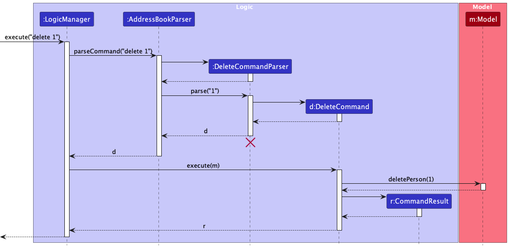
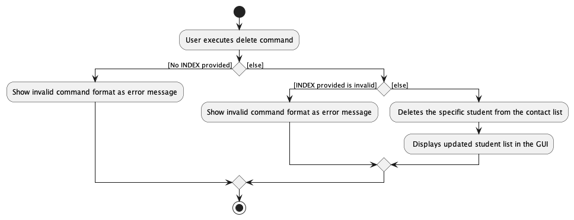
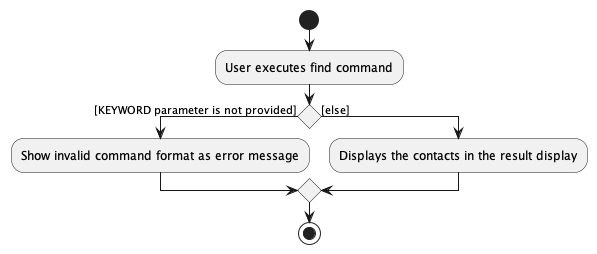
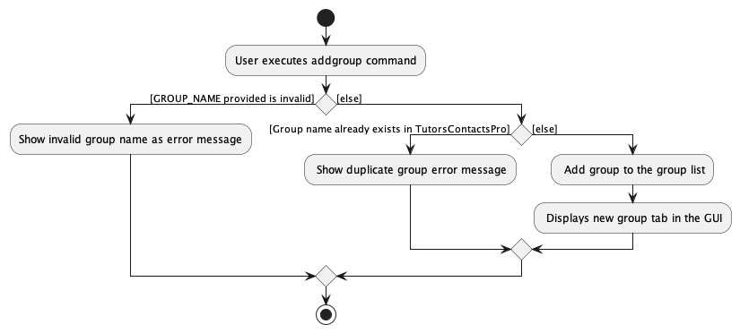
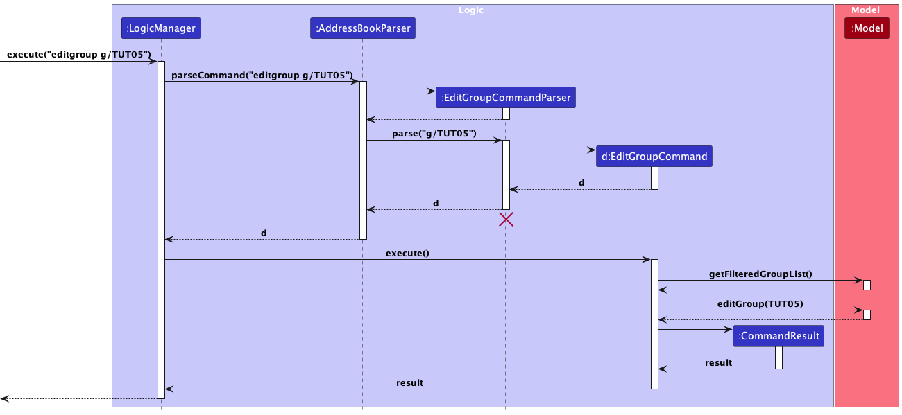
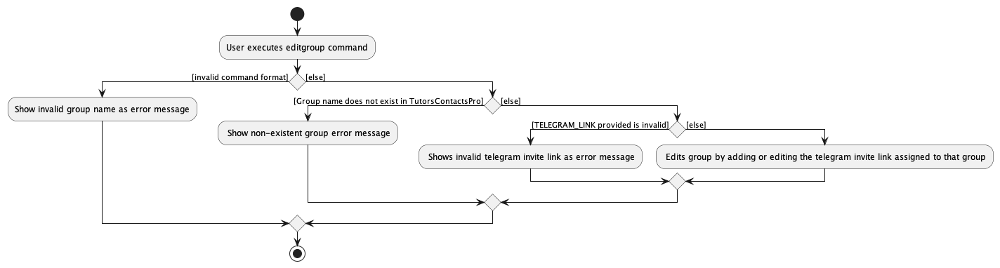
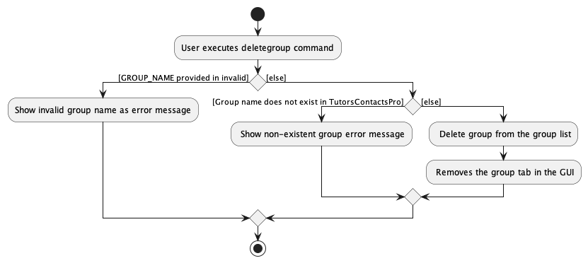

# TutorsContactsPro Developer Guide

<!-- * Table of Contents -->
<page-nav-print />

--------------------------------------------------------------------------------------------------------------------

## **Acknowledgements**

_{ list here sources of all reused/adapted ideas, code, documentation, and third-party libraries -- include links to the original source as well }_

--------------------------------------------------------------------------------------------------------------------

## **Setting up, getting started**

Refer to the guide [_Setting up and getting started_](SettingUp.md).

--------------------------------------------------------------------------------------------------------------------

## **Design**

### Architecture

<puml src="diagrams/ArchitectureDiagram.puml" width="280" />

The ***Architecture Diagram*** given above explains the high-level design of the App.

Given below is a quick overview of main components and how they interact with each other.

**Main components of the architecture**

**`Main`** (consisting of classes [`Main`](https://github.com/se-edu/addressbook-level3/tree/master/src/main/java/seedu/major/Main.java) and [`MainApp`](https://github.com/se-edu/addressbook-level3/tree/master/src/main/java/seedu/major/MainApp.java)) is in charge of the app launch and shut down.
* At app launch, it initializes the other components in the correct sequence, and connects them up with each other.
* At shut down, it shuts down the other components and invokes cleanup methods where necessary.

The bulk of the app's work is done by the following four components:

* [**`UI`**](#ui-component): The UI of the App.
* [**`Logic`**](#logic-component): The command executor.
* [**`Model`**](#model-component): Holds the data of the App in memory.
* [**`Storage`**](#storage-component): Reads data from, and writes data to, the hard disk.

[**`Commons`**](#common-classes) represents a collection of classes used by multiple other components.

**How the architecture components interact with each other**

The *Sequence Diagram* below shows how the components interact with each other for the scenario where the user issues the command `delete 1`.

<puml src="diagrams/ArchitectureSequenceDiagram.puml" width="574" />

Each of the four main components (also shown in the diagram above),

* defines its *API* in an `interface` with the same name as the Component.
* implements its functionality using a concrete `{Component Name}Manager` class (which follows the corresponding API `interface` mentioned in the previous point.

For example, the `Logic` component defines its API in the `Logic.java` interface and implements its functionality using the `LogicManager.java` class which follows the `Logic` interface. Other components interact with a given component through its interface rather than the concrete class (reason: to prevent outside component's being coupled to the implementation of a component), as illustrated in the (partial) class diagram below.

<puml src="diagrams/ComponentManagers.puml" width="300" />

The sections below give more details of each component.

### UI component

The **API** of this component is specified in [`Ui.java`](https://github.com/se-edu/addressbook-level3/tree/master/src/main/java/seedu/major/ui/Ui.java)

<puml src="diagrams/UiClassDiagram.puml" alt="Structure of the UI Component"/>

The UI consists of a `MainWindow` that is made up of parts e.g.`CommandBox`, `ResultDisplay`, `PersonListPanel`, `StatusBarFooter` etc. All these, including the `MainWindow`, inherit from the abstract `UiPart` class which captures the commonalities between classes that represent parts of the visible GUI.

The `UI` component uses the JavaFx UI framework. The layout of these UI parts are defined in matching `.fxml` files that are in the `src/main/resources/view` folder. For example, the layout of the [`MainWindow`](https://github.com/se-edu/addressbook-level3/tree/master/src/main/java/seedu/major/ui/MainWindow.java) is specified in [`MainWindow.fxml`](https://github.com/se-edu/addressbook-level3/tree/master/src/main/resources/view/MainWindow.fxml)

The `UI` component,

* executes user commands using the `Logic` component.
* listens for changes to `Model` data so that the UI can be updated with the modified data.
* keeps a reference to the `Logic` component, because the `UI` relies on the `Logic` to execute commands.
* depends on some classes in the `Model` component, as it displays `Person` object residing in the `Model`.

### Logic component

**API** : [`Logic.java`](https://github.com/se-edu/addressbook-level3/tree/master/src/main/java/seedu/major/logic/Logic.java)

Here's a (partial) class diagram of the `Logic` component:

<puml src="diagrams/LogicClassDiagram.puml" width="550"/>

The sequence diagram below illustrates the interactions within the `Logic` component, taking `execute("delete 1")` API call as an example.

<puml src="diagrams/DeleteSequenceDiagram.puml" alt="Interactions Inside the Logic Component for the `delete 1` Command" />

<box type="info" seamless>

**Note:** The lifeline for `DeleteCommandParser` should end at the destroy marker (X) but due to a limitation of PlantUML, the lifeline continues till the end of diagram.
</box>

How the `Logic` component works:

1. When `Logic` is called upon to execute a command, it is passed to an `AddressBookParser` object which in turn creates a parser that matches the command (e.g., `DeleteCommandParser`) and uses it to parse the command.
1. This results in a `Command` object (more precisely, an object of one of its subclasses e.g., `DeleteCommand`) which is executed by the `LogicManager`.
1. The command can communicate with the `Model` when it is executed (e.g. to delete a person). 
   Note that although this is shown as a single step in the diagram above (for simplicity), in the code it can take several interactions (between the command object and the `Model`) to achieve.
1. The result of the command execution is encapsulated as a `CommandResult` object which is returned back from `Logic`.

Here are the other classes in `Logic` (omitted from the class diagram above) that are used for parsing a user command:

<puml src="diagrams/ParserClasses.puml" width="600"/>

How the parsing works:
* When called upon to parse a user command, the `AddressBookParser` class creates an `XYZCommandParser` (`XYZ` is a placeholder for the specific command name e.g., `AddCommandParser`) which uses the other classes shown above to parse the user command and create a `XYZCommand` object (e.g., `AddCommand`) which the `AddressBookParser` returns back as a `Command` object.
* All `XYZCommandParser` classes (e.g., `AddCommandParser`, `DeleteCommandParser`, ...) inherit from the `Parser` interface so that they can be treated similarly where possible e.g, during testing.

### Model component
**API** : [`Model.java`](https://github.com/se-edu/addressbook-level3/tree/master/src/main/java/seedu/major/model/Model.java)

<puml src="diagrams/ModelClassDiagram.puml" width="450" />

The `Model` component,

* stores the major book data i.e., all `Person` and `Group` objects (which are contained in a `UniquePersonList` and `UniqueGroupList` object, respectively).
* stores the currently 'selected' `Person` objects (e.g., results of a search query) as a separate _filtered_ list which is exposed to outsiders as an unmodifiable `ObservableList<Person>` that can be 'observed' e.g. the UI can be bound to this list so that the UI automatically updates when the data in the list change.
* stores a `UserPref` object that represents the user’s preferences. This is exposed to the outside as a `ReadOnlyUserPref` objects.
* does not depend on any of the other three components (as the `Model` represents data entities of the domain, they should make sense on their own without depending on other components)

<box type="info" seamless>

**Note:** An alternative (arguably, a more OOP) model is given below. It has a `Group` list in the `AddressBook`, which `Person` references. This allows `AddressBook` to only require one `Group` object per unique group, instead of each `Person` needing their own `Group` objects. 

<puml src="diagrams/BetterModelClassDiagram.puml" width="450" />

</box>

### Storage component

**API** : [`Storage.java`](https://github.com/se-edu/addressbook-level3/tree/master/src/main/java/seedu/major/storage/Storage.java)

<puml src="diagrams/StorageClassDiagram.puml" width="550" />

The `Storage` component,
* can save both major book data and user preference data in JSON format, and read them back into corresponding objects.
* inherits from both `AddressBookStorage` and `UserPrefStorage`, which means it can be treated as either one (if only the functionality of only one is needed).
* depends on some classes in the `Model` component (because the `Storage` component's job is to save/retrieve objects that belong to the `Model`)

### Common classes

Classes used by multiple components are in the `seedu.addressbook.commons` package.

--------------------------------------------------------------------------------------------------------------------

## **Implementation**

This section describes some noteworthy details on how certain features are implemented.

## Delete a student 

### About

The delete student feature allows users to delete an existing student information from the student contact list
using the command `delete INDEX`.

### How it is implemented

The `delete` command mechanism is facilitated by the `DeleteCommand` and the `DeleteCommandParser`.
It allows users to delete a student contact from the student contact list.
It uses the `AddressBook#removePerson(Person key)` which is exposed in the `Model`
interface as `Model#deletePerson(Person personToDelete)`. Then, the `remove(Person person)` is called on the `UniquePersonList`
in `TutorsContactsPro` to delete the student contact from the list.  

A modification from AB3 delete mechanism is that the `delete` command also involves the facilitation of the `AddressBook#deassignPerson(Person persontToDeassign, Group group)`
which is exposed in the `Model` interface as `Model#deassignPerson(Person person, Group group)`, which result in the call of `Group#deassign(Person person)` to
deassign the deleted student contact from all previously assigned groups.

#### Parsing input

1. The users inputs the `delete` command.

2. The `TutorsContactsPro` then preliminary process the input and creates a new `DeleteCommandParser`.

3. The `DeleteCommandParser` then calls the `ParserUtil#parseIndex()` to check for the validity of the `INDEX`. At this stage, if the `INDEX is invalid or absent`, `ParseException` would be thrown.

4. The `DeleteCommandParser` then creates the `DeleteCommand` based on the processed input.

#### Command execution

5. The `LogicManager` executes the `DeleteCommand`.

6. The `DeleteCommand` calls the `Model#getFilteredPersonList()` to get the unmodifiable view of the filtered student list to get the target
   student to delete based on the provided `INDEX`.    At this stage, `CommandException` would be thrown if the input `INDEX`
   is invalid (i.e. `INDEX` exceeds the size of the student contact list).

7. The `DeleteCommand` then calls the `Model#deletePerson(Person personToDelete)` to delete the target student contact from the
   student contact list.

#### Displaying of result

8. Finally, the `DeleteCommand` creates a `CommandResult` with a success message and return it to the `LogicManager` to complete the command execution.
    The GUI would also be updated on this change in the student contact list accordingly.

The following sequence diagram shows how the `delete` mechanism works:

The following activity diagram summarizes what happens when a user executes the `delete` command:

## Find Students by Name 

### About

The `find` command allows the search of a student using name via the command `find KEYWORDS` where `KEYWORDS` is the `NAME` of the student. 

### How it is implemented
The feature is made possible through introducing an `AttributeContainsKeywordsPredicate` interface which is
implemented by all the `Person`'s attributes. Hence, there are more classes being introduced -
`NameContainsKeywordsPredicate`, `PhoneContainsKeywordsPredicate` and so on.

Given below is the example usage scenario and how the `find` mechanism behaves at each step.

#### Parsing user input

1. The user inputs the `find` command and provide the input with the name of the student in which the user wants to find the contact.

2. The `TutorsContactsPro` then does preliminary processing to the user input and creates a new `FindCommandParser`.

3. The `FindCommandParser` then parses the user input and checks whether the required `KEYWORD` is present. 

4. If the required `KEYWORD` is present, `FindCommandParser` will then call the `ParserUtil#parseName()`
   to check for the validity of the input `NAME`.  
     At this stage, `ParseException` would be thrown if the
   `NAME` specified is invalid.

5. The `FindCommandParser` then creates the `FindCommand` based on the processed inputs.

#### Command execution

6. The `LogicManager` executes the `FindCommand`.
7. The `FindCommand` calls the `Model#updateFilteredPersonList()` to update the filtered person list based on the user input `KEYWORD`.
8. The `FindCommand` then calls the `Model#getFilteredPersonList()#size()` to get the size of the person list. The size will correspond to the number of persons listed.

#### Displaying of result
9. Finally, the `FindCommand` creates a `CommandResult` with a success message and return it to the `LogicManager` to complete the command execution.
   The GUI would also be updated on this change in the student list and update the display of student list accordingly.

The following sequence diagram shows how the `find` mechanism works:

The following activity diagram summarizes what happens when a user executes the `find` command:

### Design considerations

#### Aspect: How the find command finds the student 

* **Alternative 1 (current choice)**: finds student contact without any prefixes.
    * Pros: Simplifies the process for users to find student contacts without needing to recall any specific prefixes. This makes the command easy to remember. 
    * Cons: In some cases, the prefix can serve as a reminder on what student attribute is used for `find` command to search for students. User may be left confused and find difficult to remember that find search for students using their name without the `n/` prefix. 

* **Alternative 2 (current choice)**: finds through partial search (eg. `Dav` to find `David`)
    * Pros: Enables users to save time by not requiring complete details for the search.
    * Cons: When there are multiple contacts with similar names (e.g., Ben, Benedict, Benny), a partial search may not yield significant benefits, as users would still need to input almost the full name to locate the desired person.

## Filter Students by Group

#### About
The filter students by group feature allows users to filter and list students in the address book whose group name matches the specified keywords. 
It helps users to quickly find students belonging to specific groups.

#### How it is implemented
The filtering mechanism is facilitated by the `FilterCommand` and the `FilterCommandParser`. 
It enables users to filter students based on the groups they belong to. It utilizes the `Model` interface to interact with the student contact list.

#### Parsing input

1. The users inputs the `filter` command along with the group keywords.

2. The TutorsContactsPro then preliminarily processes the input and creates a new `FilterCommandParser`.

3. The `FilterCommandParser` then checks for the validity of the provided group keywords. If the keywords are invalid or absent, a `ParseException` is thrown.

4. The `FilterCommandParser` creates the `FilterCommand` based on the processed input, with a `GroupContainsKeywordsPredicate` to filter students based on the specified groups.

#### Command execution

5. The `LogicManager` executes the `FilterCommand`.

6. The `FilterCommand` calls the `Model#updateFilteredPersonList()` method to update the filtered person list according to the specified group keywords.

#### Displaying results

7. Finally, the `FilterCommand` creates a CommandResult with the list of students matching the specified groups, and returns it to the LogicManager to complete the command execution. 
The GUI would also be updated accordingly to display the filtered list of students.

The following sequence diagram illustrates how the `filter` mechanism works:

The following activity diagram summarizes what happens when a user executes the `filter` command:

### Design considerations

#### Aspect: How the filter command filters student 

* **Alternative 1 (current choice)**: filters student contact without any prefixes.
    * Pros: Simplifies the process for users to find student contacts without needing to recall any specific prefixes. This makes the command easy to remember.
    * Cons: In some cases, the prefix can serve as a reminder on what student attribute is used for `filter` command to search for students. User may confuse this command with the previous `find` command. 

* **Alternative 2**: filter only allows for a single `GROUP_NAME` input 
    * Pros: Enables users to filter students via a single group so that it remains more organised. 
    * Cons: There may be cases where a student belongs to more than one group that is taught by the user. This will result in inconvenience when the user wants to retrieve student data from multiple groups.
      E.g. `John` belongs to both `TUT04`and `LAB05` that is taught by the user. Filter student contacts separately for the two groups will result in `John` contact to appear twice which can be inconvenient when the user wants to retrieve unique student contacts from the two groups. 

* **Alternative 3 (current choice)**: filter only allows for multiple `GROUP_NAME` input
    * Pros: Enables users to obtain unique student contact list from multiple groups. 
    * Cons: It may not be commonly used as users are more likely to filter via a single group since the `Results` tab wil already display all student contacts.

## Mark Student's Attendance

#### About

Marks the student's attendance according to the group name and week number. This allows users to easily keep track of students' attendance details.

#### How it is implemented
The mark attendance mechanism is facilitated by the `MarkAttendanceCommand` and the `MarkAttendanceCommandParser`. 
It utilizes the `Model` interface to interact with the student contact list.

#### Parsing input

1. The users inputs the `mark` command along with the desired student index, group name, week number and the student's attendance (whether they are present, `P` or absent `A`)

2. The TutorsContactsPro then preliminarily processes the inputs and creates a new `MarkAttendanceCommandParser`.

3. The `MarkAttendanceCommandParser` then parses the user input and checks whether all the input attributes are present by checking the presence of the prefixes for group, week and attendance which are `/g`, `/w` and `/a` respectively. 
   It also checks whether the command is in the correct format.     At this stage, if not all the prefixes are present,
   `ParseException` would be thrown.

#### Command execution

5. The `LogicManager` executes the `MarkAttendanceCommand`.

6. The `MarkAttendanceCommand` calls the `Model#getFilteredPersonList()` to get the unmodifiable view of the filtered student list to get the target
   student to mark attendance based on the provided `INDEX`.    At this stage, `CommandException` would be thrown if the input `INDEX`
   is invalid (i.e. `INDEX` exceeds the size of the student contact list).

#### Displaying results

7. Finally, the `MarkAttendanceCommand`  it returns a CommandResult object indicating the success or failure of the operation. 
The result message is then displayed to the user via the GUI. The attendance table of the particular studne will then be updated accordingly. 

The following activity diagram summarizes what happens when a user executes the `mark` command:

  

## Add group feature

### About

The add group feature allows users users to create a new group in TutorsContactsPro. 
`addgroup g/GROUP_NAME`.

### How it is implemented

The `addgroup` command mechanism is facilitated by the `AddGroupCommand` and the `AddGroupCommandParser`.
It allows TA users to add a not-already-existing-group to TutorsContactsPro.
It uses the `AddressBook#addGroup(Group group)` which is exposed in the `Model`
interface as `Model#addGroup(Group group)`. Then, the `add(Group groupToAdd)` is called on the `UniqueGroupList`
in `AddressBook` to add the group to the group list.

Given below is the example usage scenario and how the add group mechanism behaves at each step.

#### Parsing user input

1. The users user inputs the `addgroup` command and provides the `GROUP_NAME` of the group in which the TA user wants to add.

2. The `TutorsContactsPro` then does preliminary processing to the input and creates a new `AddGroupCommandParser`.

3. The `AddGroupCommandParser` then parses the user input and checks whether all the input attributes are present by checking the presence of the prefixes.
   It also checks whether the command is in the correct format. In this case, the required prefix and attribute is `g/GROUP_NAME`.     At this stage, if not all the prefixes are present,
   `ParseException` would be thrown.

4. If the required prefixes and attributes are present (i.e. `g/GROUP_NAME`), `AddGroupCommandParser` will then call the `ParserUtil#parseGroupName()`
   method to check for the validity of the input `GROUP_NAME`.     At this stage, `ParseException` would be thrown if the
   `GROUP_NAME` specified is invalid. 

5. The `AddGroupCommandParser` then creates the `AddGroupCommand` based on the processed input.

#### Command execution

6. The `LogicManager` executes the `AddGroupCommand`.

7. The `AddGroupCommand` calls the `Model#hasGroup()` to check if the group with the same `GROUP_NAME` has already existed in the group list.
   `CommandException` would be thrown if there already existed a group with the same group name.

8. The `AddGroupCommand` then calls the `Model#addGroup()` to add the input group to the list.

#### Displaying of result

9. Finally, the `AddGroupCommand` creates a `CommandResult` with a success message and return it to the `LogicManager` to complete the command execution.
   The GUI would also be updated on this change and created a new dedicated group tab for this new group added.

The following sequence diagram shows how the `addgroup` mechanism works:

The following activity diagram summarizes what happens when a user executes the `addgroup` command:

## Edit group feature

### About

The edit group feature allows users to add or edit the Telegram invite link assigned for each group. 
`editgroup g/GROUP_NAME tg/TELEGRAM_LINK`.

### How it is implemented

The `editgroup` command mechanism is facilitated by the `EditGroupCommand` and the `EditGroupCommandParser`.
It allows TA users to edit an existing group in TutorsContactsPro.
It uses the `AddressBook#addGroup(Group group)` which is exposed in the `Model`

Given below is the example usage scenario and how the add group mechanism behaves at each step.

#### Parsing user input

1. The users user inputs the `editgroup` command and provides the `GROUP_NAME` of the group in which the user wants to add or edit using the new `TELEGRAM_LINK` provided. 

2. The `TutorsContactsPro` then does preliminary processing to the input and creates a new `EditGroupCommandParser`.

3. The `EditGroupCommandParser` then parses the user input and checks whether all the input attributes are present by checking the presence of the prefixes.
   It also checks whether the command is in the correct format. In this case, the required prefix and attribute is `g/GROUP_NAME` and `tg/TELEGRAM_LINK`.     At this stage, if not all the prefixes are present,
   `ParseException` would be thrown.

4. If the required prefixes and attributes are present (i.e. `g/GROUP_NAME`), `EditGroupCommandParser` will then call the `ParserUtil#parseGroupName()`
   method to check for the validity of the input `GROUP_NAME` and `TELEGRAM_LINK`.     At this stage, `ParseException` would be thrown if the
   `GROUP_NAME` or `TELEGRAM_LINK` specified is invalid.

5. The `EditGroupCommandParser` then creates the `EditGroupCommand` based on the processed input.

#### Command execution

6. The `LogicManager` executes the `EditGroupCommand`.

7. The `EditGroupCommand` calls the `Model#hasGroup()` to check if the group with the `GROUP_NAME` already existed in the group list.
   `CommandException` would be thrown if there are no group present with the same group name.

8. The `EditGroupCommand` then calls the `Model#editroup()` to edit the input group's Telegram invite link.

#### Displaying of result

9. Finally, the `EditGroupCommand` creates a `CommandResult` with a success message and return it to the `LogicManager` to complete the command execution.

The following sequence diagram shows how the `editgroup` mechanism works:

The following activity diagram summarizes what happens when a user executes the `editgroup` command:

## Delete group feature

### About 

The delete group feature allows users to delete an existing student group in
the student group list via the command `deletegroup g/GROUP_NAME`.

### How it is implemented

The `deletegroup` command mechanism is facilitated by the `DeleteGroupCommand` and the `DeleteGroupCommandParser`.
It allows users to delete an already-existing-group from the ArchDuke student group list. It uses the `AddressBook#removeGroup(Group key)`
which is exposed in the `Model` interface as `Model#deleteGroup(Group target)`. Then, the `remove(Group toRemove)` is called on the `UniqueGroupList`
to remove the group from the group list.

Given below is the example usage scenario and how the delete group mechanism behaves at each step.

#### Parsing user input

1. The user inputs the `deletegroup` command and provide the `GROUP_NAME` of the group in which the user wants to remove.

2. The `TutorsContactsPro` then does preliminary processing to the user input and creates a new `DeleteGroupCommandParser`.

3. The `DeleteGroupCommandParser` then parses the user input and check whether all the input attributes are present by checking the presence of the prefixes.
   It also checks whether the command is in the correct format. In this case, the required prefix and attribute is `g/GROUP_NAME`.     At this stage, if not all the prefixes are present,
   `ParseException` would be thrown.

4. If the required prefixes and attributes are present (i.e. `g/GROUP_NAME`), `DeleteGroupCommandParser` will then call the `ParserUtil#parseGroupName()`
   method to check for the validity of the input `GROUP_NAME`.     At this stage, `ParseException` would be thrown if the
   `GROUP_NAME` specified is invalid.

5. The `DeleteGroupCommandParser` then creates the `DeleteGroupCommand` based on the processed input.

#### Command execution

6. The `LogicManager` executes the `DeleteGroupCommand`.

7. The `DeleteGroupCommand` calls the `Model#getFilteredGroupList()` to get the current unmodifiable view of the filtered group list.

8. The `DeleteGroupCommand` calls the `contains()` method on the obtained filtered group list to check if the group with the same `GROUP_NAME` existed in the group list.
   `CommandException` would be thrown if there exists no group with the same group name.

9. The `DeleteGroupCommand` then calls the `Model#deleteGroup()` to delete the input group to from the group list.

#### Displaying of result

10. Finally, the `DeleteGroupCommand` creates a `CommandResult` with a success message and return it to the `LogicManager` to complete the command execution.
    The GUI would also be updated on this change and remove the dedicated group tab for the group deleted. 

The following sequence diagram shows how the `deletegroup` mechanism works:

The following activity diagram summarizes what happens when a user executes the `deletegroup` command:

## Mail Command

### About

The Mail Command feature enables users to generate an email template prefilled with the email addresses of students filtered based on specified keywords. 
This command can be used to compose emails to these students directly from the user's default email client.

### How it is Implemented

The Mail Command feature is implemented using the `MailCommand` class and its corresponding parser, `MailCommandParser`.

#### Command Structure

The user inputs the `mail` command followed by optional keywords specifying groups of students they want to include in the email.

#### Parsing Input

1. The `MailCommandParser` parses the input arguments to extract the specified keywords.

2. If no keywords are provided, an empty `MailCommand` is created, which results in the generation of a mailto link for all students.

3. If keywords are provided, the parser validates them to ensure they conform to the expected format. If any keyword is invalid, a `ParseException` is thrown.

4. The `MailCommand` with the appropriate predicate is then created using the `GroupContainsKeywordsPredicate`, which filters the students based on the specified keywords.

#### Command Execution

5. When the `MailCommand` is executed, it updates the filtered person list in the model based on the provided predicate.

6. It then extracts the email addresses of the filtered students from the model.

7. Using these email addresses, it generates a mailto link, concatenating them with semicolons to form a single string.

#### Displaying Result

8. Finally, the generated mailto link is encapsulated in a `CommandResult` object and returned to the logic manager for further handling.

### Summary

The Mail Command feature provides an efficient way for users to compose emails to specific groups of students directly from the application. By leveraging the power of filtering, it allows for targeted communication while maintaining simplicity and ease of use.

The following activity diagram illustrates how the `mail` mechanism works:

## Mailtg Command

### About

The Mailtg Command feature enables users to generate an email template containing the Telegram link for a specific group and prefilled with the email addresses of students filtered based on specified keywords.
This command can be used to compose emails to these students directly from the user's default email client.

## How it is Implemented

The Mailtg Command feature is implemented using the `MailTelegramCommand` class and its corresponding parser, `MailTelegramCommandParser`.

#### Command Structure

The user inputs the `mailtg` command followed by the `/g` prefix and the keywords specifying groups of students they want to include in the email and the specific group's Telegram invite link.

#### Parsing Input

1. The `MailTelegramCommandParser` parses the input arguments to extract the specified keywords.

2. If keywords are provided, the parser validates them to ensure they conform to the expected format. If any keyword is invalid, a `ParseException` is thrown.

3. The `MailTelegramCommand` with the appropriate predicate is then created using the `GroupContainsKeywordsPredicate`, which filters the students based on the specified keywords.

#### Command Execution

4. When the `MailTelegramCommand` is executed, it updates the filtered person list in the model based on the provided predicate.

5. It then extracts the email addresses of the filtered students from the model and the Telegram invite link assigned to the specific group. 

6. Using these email addresses and Telegram invite link, it generates a mailto link using the `createMailtoUrl` function.

#### Displaying Result

8. Finally, the generated mailto link is encapsulated in a `CommandResult` object and returned to the logic manager for further handling.

### Summary

The Mailtg Command feature provides an efficient way for users to compose emails to specific groups of students directly from the application. By leveraging the power of filtering, it allows for targeted communication while maintaining simplicity and ease of use.

The following activity diagram illustrates how the `mailtg` mechanism works:

### \[Proposed\] Undo/redo feature

#### Proposed Implementation

The proposed undo/redo mechanism is facilitated by `VersionedAddressBook`. It extends `AddressBook` with an undo/redo history, stored internally as an `addressBookStateList` and `currentStatePointer`. Additionally, it implements the following operations:

* `VersionedAddressBook#commit()` — Saves the current major book state in its history.
* `VersionedAddressBook#undo()` — Restores the previous major book state from its history.
* `VersionedAddressBook#redo()` — Restores a previously undone major book state from its history.

These operations are exposed in the `Model` interface as `Model#commitAddressBook()`, `Model#undoAddressBook()` and `Model#redoAddressBook()` respectively.

Given below is an example usage scenario and how the undo/redo mechanism behaves at each step.

Step 1. The user launches the application for the first time. The `VersionedAddressBook` will be initialized with the initial major book state, and the `currentStatePointer` pointing to that single major book state.

<puml src="diagrams/UndoRedoState0.puml" alt="UndoRedoState0" />

Step 2. The user executes `delete 5` command to delete the 5th person in the major book. The `delete` command calls `Model#commitAddressBook()`, causing the modified state of the major book after the `delete 5` command executes to be saved in the `addressBookStateList`, and the `currentStatePointer` is shifted to the newly inserted major book state.

<puml src="diagrams/UndoRedoState1.puml" alt="UndoRedoState1" />

Step 3. The user executes `add n/David …​` to add a new person. The `add` command also calls `Model#commitAddressBook()`, causing another modified major book state to be saved into the `addressBookStateList`.

<puml src="diagrams/UndoRedoState2.puml" alt="UndoRedoState2" />

<box type="info" seamless>

**Note:** If a command fails its execution, it will not call `Model#commitAddressBook()`, so the major book state will not be saved into the `addressBookStateList`.

</box>

Step 4. The user now decides that adding the person was a mistake, and decides to undo that action by executing the `undo` command. The `undo` command will call `Model#undoAddressBook()`, which will shift the `currentStatePointer` once to the left, pointing it to the previous major book state, and restores the major book to that state.

<puml src="diagrams/UndoRedoState3.puml" alt="UndoRedoState3" />

<box type="info" seamless>

**Note:** If the `currentStatePointer` is at index 0, pointing to the initial AddressBook state, then there are no previous AddressBook states to restore. The `undo` command uses `Model#canUndoAddressBook()` to check if this is the case. If so, it will return an error to the user rather
than attempting to perform the undo.

</box>

The following sequence diagram shows how an undo operation goes through the `Logic` component:

<puml src="diagrams/UndoSequenceDiagram-Logic.puml" alt="UndoSequenceDiagram-Logic" />

<box type="info" seamless>

**Note:** The lifeline for `UndoCommand` should end at the destroy marker (X) but due to a limitation of PlantUML, the lifeline reaches the end of diagram.

</box>

Similarly, how an undo operation goes through the `Model` component is shown below:

<puml src="diagrams/UndoSequenceDiagram-Model.puml" alt="UndoSequenceDiagram-Model" />

The `redo` command does the opposite — it calls `Model#redoAddressBook()`, which shifts the `currentStatePointer` once to the right, pointing to the previously undone state, and restores the major book to that state.

<box type="info" seamless>

**Note:** If the `currentStatePointer` is at index `addressBookStateList.size() - 1`, pointing to the latest major book state, then there are no undone AddressBook states to restore. The `redo` command uses `Model#canRedoAddressBook()` to check if this is the case. If so, it will return an error to the user rather than attempting to perform the redo.

</box>

Step 5. The user then decides to execute the command `list`. Commands that do not modify the major book, such as `list`, will usually not call `Model#commitAddressBook()`, `Model#undoAddressBook()` or `Model#redoAddressBook()`. Thus, the `addressBookStateList` remains unchanged.

<puml src="diagrams/UndoRedoState4.puml" alt="UndoRedoState4" />

Step 6. The user executes `clear`, which calls `Model#commitAddressBook()`. Since the `currentStatePointer` is not pointing at the end of the `addressBookStateList`, all major book states after the `currentStatePointer` will be purged. Reason: It no longer makes sense to redo the `add n/David …​` command. This is the behavior that most modern desktop applications follow.

<puml src="diagrams/UndoRedoState5.puml" alt="UndoRedoState5" />

The following activity diagram summarizes what happens when a user executes a new command:

<puml src="diagrams/CommitActivityDiagram.puml" width="250" />

#### Design considerations:

**Aspect: How undo & redo executes:**

* **Alternative 1 (current choice):** Saves the entire major book.
  * Pros: Easy to implement.
  * Cons: May have performance issues in terms of memory usage.

* **Alternative 2:** Individual command knows how to undo/redo by
  itself.
  * Pros: Will use less memory (e.g. for `delete`, just save the person being deleted).
  * Cons: We must ensure that the implementation of each individual command are correct.

--------------------------------------------------------------------------------------------------------------------

## **Documentation, logging, testing, configuration, dev-ops**

* [Documentation guide](Documentation.md)
* [Testing guide](Testing.md)
* [Logging guide](Logging.md)
* [Configuration guide](Configuration.md)
* [DevOps guide](DevOps.md)

--------------------------------------------------------------------------------------------------------------------

## **Appendix: Requirements**

### Product scope

**Target user profile**:

* A computer science TA (Teaching Assistant) managing students for tutorials
* has numerous of students to manage in a tutorial slot
* has to add, list, delete, sort, search students in the app
* is reasonably comfortable using CLI apps
* can type fast
* can switch between different tutorial classes
* prefer desktop apps over other types

**Value proposition**: manage students faster than a typical GUI driven app

### User stories

Priorities: High (must have) - `* * *`, Medium (nice to have) - `* *`, Low (unlikely to have) - `*`

| Priority | As a …​     | I want to …​                                            | So that I can…​                                                                                  |
|----------|-------------|---------------------------------------------------------|--------------------------------------------------------------------------------------------------|
| `* * *`  | TA          | add new students to the app                             | keep track of their information                                                                  |
| `* * *`  | TA          | edit student profiles                                   | keep their information up to date.                                                               |
| `* * *`  | TA          | delete students from my class                           | track the existing number of students in my tutorial class                                       |
| `* * *`  | TA          | list all students in my class(es)                       | view all of my students’ details at one glance                                                   |
| `* * *`  | TA          | search for specific students using keywords             | quickly find relevant information                                                                |
| `* * *`  | TA          | filter students according to their group                | quickly find relevant information                                                                |
| `* * *`  | TA          | mark attendance for a specific student                  | keep track of each student's attendance details                                                  |
| `* * *`  | TA          | add a new group                                         | keep track of the groups that i teach                                                            |
| `* * *`  | TA          | add a Telegram link to each group                       | keep track of the Telegram invite links for each group that i teach                              |
| `* * *`  | TA          | delete an existing group                                | track the existing number of groups that i currently teach                                       |
| `* * *`  | TA          | generate an email template                              | conveniently sent an email to the student recipients desired                                     |
| `* * *`  | TA          | generate an email template containing the Telegram link | conveniently sent an email containing the Telegram invite link to the student recipients desired |
| `* *`    | new TA user | be able to access a help window                         | easily seek help for the errors encountered                                                      |

### Use cases

(For all use cases below, the **System** is the `TutorsContactsPro` and the **Actor** is the `Tutor`, unless specified otherwise)

**Use case: UC01 - Add a student**

**MSS**

1.  TA requests to list students
2.  System shows a list of students
3.  TA requests to add a specific student to the list
4.  System adds the student

    Use case ends.

**Extensions**

* 2a. The list is empty.

  Use case ends.

* 3a. The add command parameters are invalid or incomplete.

    * 3a1. TutorsContactsPro shows an error message.

      Use case resumes at step 2.

* 3b. TutorsContactsPro detects that the student already exists on the list.

    * 3b1. TutorsContactsPro informs the TA that the student already exists on the list.
    * 3b2. TA confirms cancellation of adding the student.
      
      Use case ends.
    

**Use case: UC02 - Edit a student**

**MSS**

1.  TA requests to list students
2.  System shows a list of students
3.  TA requests to edits the particulars of the student
4.  System records the changes

    Use case ends.

**Extensions**

* 2a. The list is empty.

  Use case ends.

* 3a. The given index is invalid.

    * 3a1. TutorsContactsPro shows an error message.

      Use case resumes at step 2.
  
* 3b. The edit command parameters are invalid or incomplete.

    * 3b1. TutorsContactsPro shows an error message.

      Use case resumes at step 2.

**Use case: UC03 - Delete a student**

**MSS**

1.  TA requests to list students
2.  System shows a list of students
3.  TA requests to delete a student
4.  System records the changes

    Use case ends.

**Extensions**

* 2a. The list is empty.

  Use case ends.

* 3a. The given index is invalid.

    * 3a1. TutorsContactsPro shows an error message.

      Use case resumes at step 2.

**Use case: UC04 - List all students**

**MSS**

1.  TA requests to list students
2.  System shows a list of students

    Use case ends.

**Extensions**

* 2a. The list is empty.

  Use case ends.

**Use case: UC05 - Find a student**

**MSS**

1.  TA requests to list students
2.  System shows a list of students
3.  TA finds student(s) by keyword
4.  System shows a list of students matching the keyword

    Use case ends.

**Extensions**

* 2a. The list is empty.

  Use case ends.

* 3a. The given keyword is in an incorrect format (e.g., contains special characters not allowed, exceeds maximum length).
  
  * 3a1. TutorsContactsPro shows an error message.
    Use case resumes at step 2.

* 4a. The list of search results is empty.

  Use case ends.

**Use case: UC06 - Filter students according to their group**

**MSS**

1.  TA requests to list students
2.  System shows a list of students
3.  TA filters student(s) by keyword which is the group name desired
4.  System shows a list of students that belong to the group 

    Use case ends.

**Extensions**

* 2a. The list is empty.

  Use case ends.

* 3a. The given keyword is in an incorrect format (e.g., contains special characters not allowed, exceeds maximum length, incorrect group name format).

    * 3a1. TutorsContactsPro shows an error message.
      Use case resumes at step 2.

* 4a. The list of search results is empty.

  Use case ends.

**Use case: UC07 - Mark student's attendance**

**MSS**

1.  TA requests to list students
2.  System shows a list of students
3.  TA marks the attendance of a specific student from a particular group during a lesson week 
4.  System updates the attendance the student for that particular group accordingly 

    Use case ends.

**Extensions**

* 2a. The list is empty.

  Use case ends.

* 3a. The given keyword is in an incorrect format (e.g., contains special characters not allowed, exceeds maximum length, incorrect group name format).

    * 3a1. TutorsContactsPro shows an error message.
      Use case resumes at step 2.

**Use case: UC08 - Add a group**

**MSS**

1. TA requests to add a specific group 

2. System adds the group

    Use case ends.

**Extensions**

* 1a. The addgroup command parameters are invalid or incomplete.

    * 1a1. TutorsContactsPro shows an error message.

      Use case resumes at step 2.

* 1b. TutorsContactsPro detects that the group already exists on the list.

    * 1b1. TutorsContactsPro informs the tutor that the group already exists on the list.
    * 1b2. Tutor confirms cancellation of adding the group.

      Use case ends.

**Use case: UC09 - Add a Telegram link**

**MSS**

1.  TA requests to add a specific Telegram link to a particular group
2.  System adds the Telegram link to the group

    Use case ends.

**Extensions**

* 1a. The given Telegram link is invalid or incomplete.

  Use case resumes at step 1.

**Use case: UC10 - Delete a group**

**MSS**

1. TA requests to delete a student
2. System records the changes

    Use case ends.

**Extensions**

* 1a. The given group name parameter is invalid or incomplete.

    * 1a1. TutorsContactsPro shows an error message.

      Use case resumes at step 1.

**Use case: UC011 - Generate email template**

**MSS**

1.  TA requests generation of an email template for specific group(s)
2.  System shows the email template prefilled with emails of specific students recipients

    Use case ends.

**Extensions**

* 1a. The given group name parameter is invalid.

    Use case resumes at step 1.

**Use case: UC012 - Generate email template containing Telegram invite link**

**MSS**

1.  TA requests generation of an email template to send the Telegram invite link for a specific group
2.  System shows the email template prefilled with emails of specific students recipients and the Telegram invite link for that particular group

    Use case ends.

**Extensions**

* 1a. The given group name parameter is invalid.

  Use case resumes at step 1.

### Non-Functional Requirements

1.  Should work on any _mainstream OS_ as long as it has Java `11` or above installed.
2. A user with above average typing speed for regular English text (i.e. not code, not system admin commands) should be able to accomplish most of the tasks faster using commands than using the mouse.
3. Should be able to list a maximum of 50 students within a single tutorial slot.
4. Should be able to hold a maximum of 300 students in total without any significant decrease in performance.
5. Any command should be visible within 3 seconds, ensuring a smooth and efficient user experience.
6. The system should have an uptime of at least 99%, allowing tutors to access student information reliably at any time.
7. Student important information (i.e name, email, Telegram handle, contact number) should be encrypted both in transit and at rest to prevent unauthorized access.
8. The system should implement secure authentication mechanisms, such as multi-factor authentication, to verify the identity of users.
9. TAs should only have access to student information for classes they are assigned to, ensuring data privacy.
10. The system should be able to scale horizontally to accommodate an increase in the number of users and classes without compromising performance.
11. Regular backups of the system database should be performed, with a robust disaster recovery plan in place to restore data in case of any unexpected failures or outages.

### Glossary

* **Mainstream OS**: Windows, Linux, Unix, MacOS
* **TA**: TA (Teaching Assistant) refers to the person who teaches in a single tutorial/recitation/lab group. 
* **Student**: Student refers to an individual who attends a tutorial class taught by the tutor.
* **Group**: Smaller classes in university which allow discussion of lecture content and assignment. This consists of tutorial, recitation and labs. 
* **CLI (Command-Line Interface)**: A text-based interface used to interact with the software by entering commands into a terminal or console window, typically preferred by users who prefer efficiency and automation.
* **GUI (Graphical User Interface)**: A GUI is a user interface that employs graphical elements such as icons, buttons, and menus for user interaction, providing an intuitive and visually appealing way to navigate and use software.

--------------------------------------------------------------------------------------------------------------------

## **Appendix: Instructions for manual testing**

### Prefix summary
These are the list of prefixes used in the commands for manual testing.

| Prefix | Representation    | 
|--------|-------------------|
| `n/`   | `NAME`            | 
| `p/`   | `PHONE_NUMBER`    | 
| `e/`   | `EMAIL`           | 
| `y/`   | `YEAR`            |
| `m/`   | `MAJOR`           | 
| `tg/`  | `TELEGRAM_HANDLE` | 
| `r/`   | `REMARKS`         | 
| `g/`   | `GROUP_NAME`      | 

Given below are instructions to test the app manually.

<box type="info" seamless>

**Note:** These instructions only provide a starting point for testers to work on;
testers are expected to do more *exploratory* testing.

</box>

### Launch and shutdown

1. Initial launch

   i. Download the jar file and copy into an empty folder

   ii. Double-click the jar file Expected: Shows the GUI with a set of sample contacts. The window size may not be optimum.

2. Saving window preferences

   i. Resize the window to an optimum size. Move the window to a different location. Close the window.

   ii. Re-launch the app by double-clicking the jar file. 
       Expected: The most recent window size and location is retained.

### Listing all students

1. Listing all students 

   i. Test case: `list` 
       Expected: All students will be returned from the list. The number of students listed is shown in the status message. Timestamp in the status bar is updated.

### Clearing data

1. Clears all data in TutorsContactsPro
    
    i. Test case: `clear`  
        Expected: All data is cleared from TutorsContactsPro.

### Exiting TutorsContactsPro

1. Exits TutorsContactsPro

    i. Test case: `exit`  
        Expected: Exits TutorsContactsPro, and all data is being saved.

### Help

1. Provides detailed information on how to use the different features in TutorsContactsPro

   i. Test case: `help`  
       Expected: Help window pops up.

   ii. Test case: Press the `F1` key  
        Expected: Similar to previous.

### Adding a student

1. Adding a student while student list is being shown

   i. Prerequisites: List all students using the `list` command.

   ii. Test case: `add n/John Doe p/98765432 e/johnd@example.com y/2 m/Computer Science tg/johndoe r/Very quiet student g/TUT04 g/LAB10 `
        Expected: Adds a student with the name `John Doe` and the following attributes to the list. Details of added student shown in the status message.
      * Phone number: 98765432,
      * Email address: johnd@example.com
      * Telegram handle: johndoe
      * Year of study: 2
      * Major: Computer Science
      * Remarks: Very quiet student
      * Groups: TUT04 and LAB10

   iii. Test case : `add s/J@hn Doe m/A0123459G`  
       Expected: No student is added. Error details are shown in the status message.

   iv. Test case : `add s/John Doe `  
       Expected: Similar to previous.

### Deleting a student

1. Deleting a student while all students are being shown

   i. Prerequisites: List all students using the `list` command. There can be multiple students in the list.

   ii. Test case: `delete 1` 
      Expected: First student is deleted from the list. Details of the deleted student is shown in the status message. Timestamp in the status bar is updated.

   iii. Test case: `delete 0` 
      Expected: No student is deleted. Error details shown in the status message. Status bar remains the same.

   iv. Other incorrect delete commands to try: `delete`, `delete x`, `...` (where x is larger than the list size) 
      Expected: Similar to previous.

### Editing a student

1. Edit a student to change their name/phone number/email address/year of study/major/Telegram handle/remark/group

    1. Prerequisites: List all students using the `list` command. There must be at least one student in the list.

    2. Test case: `edit 1 n/John`  
       Expected: First student's name is changed to John for all instances. Other attributes of the student remains the same. Details of the new student name is shown in the status message.

    3. Test case: `edit 0 n/John`  
       Expected: No student's details is changed. Error details shown in the status message.

    4. Other incorrect edit student commands to try: `edit x n/John`, edit 1 n/John p/12345678`, `...` (where x is larger than the list size)  
       Expected: Similar to previous.

### Finding student(s) by keyword(s)

1. Finding a student while all students are being shown

   i. Prerequisites: List all students using the `list` command. There can be multiple persons in the list. 

   ii. Test case: `find Al Yu` 
       Expected: Students who have any part of their names starting with `Al` or `Yu` like `Alex Yeoh` and `Bernice Yu` will be returned from the list. The number of contacts found is shown in the status message. Timestamp in the status bar is updated.

   iii. Test case: `find Zoe`, assuming that there is no contact who has any part of his/her name starting with `Zoe` 
       Expected: No student is found. Error details shown in the status message. Status bar remains the same.

   iv. Other incorrect find commands to try: `find` 
       Expected: Similar to previous.

### Filtering student(s) by keyword(s)

1. Filtering students while all students are being shown

   i. Prerequisites: List all students using the `list` command. There can be multiple persons in the list.

   ii. Test case: `filter TUT10` 
   Expected: Students who belongs to the group `TUT10` will be returned from the list. The number of contacts found is shown in the status message. Timestamp in the status bar is updated.

   iii. Test case: `filter TUT01`, assuming that there is no contact who belongs to the group `TUT01`  
   Expected: No student is found. Error details shown in the status message. Status bar remains the same.

   iv. Test case: `filter TU01`, where an invalid `KEYWORD/GROUP_NAME` is provided  
   Expected: No student is found. Error details shown in the status message. Status bar remains the same.

   v. Other incorrect find commands to try: `filter` 
   Expected: Similar to previous.

### Marking attendance 

1. Marking attendance of students while all students are being shown

   i. Prerequisites: List all students using the `list` command. There can be multiple persons in the list.

   ii. Test case: `mark 1 g/TUT05 w/1 a/P` 
   Expected: Marks the attendance of the 1st student in the list. Marks `TUT05` week 1 attendance as present. Details updated in the status message. Timestamp in the status bar is updated.

   iii. Test case: `mark 1 g/TUT01 w/1 a/P`, assuming that there is no contact who belongs to the group `TUT01`  
   Expected: No student is found. Error details shown in the status message. Status bar remains the same.

   iv. Test case: `mark 1 g/T05 w/1 a/P`, where an invalid `GROUP_NAME` is provided  
   Expected: Error details shown in the status message. Status bar remains the same.

   v. Test case: `mark 1 g/TUT05 w/0 a/P`, where an invalid week number is provided  
   Expected: Error details shown in the status message. Status bar remains the same.

   vi. Test case: `mark 1 g/TUT05 w/1 a/B`, where an invalid `ATTENDANCE` field is provided  
   Expected: Error details shown in the status message. Status bar remains the same.

   vii. Other incorrect find commands to try: `mark` 
   Expected: Similar to previous.

### Adding a group

1. Adding a group that has yet to exist in TutorsContactsPro.

   i. Prerequisites: List all lessons using the `list` command.

   ii. Test case: `addgroup g/LAB12` where group `LAB12` does not exist in TutorsContactsPro  
       Expected: Adds the group `LAB12` to TutorContactsPro. A new group tab labelled `LAB12` is added. Details of the studio added shown in status message.
   
   iii. Test case: `addgroup g/RE1` where an invalid `GROUP_NAME` is provided  
        Expected: No group added. Error details shown in the error message.

   iv. Test case: `addgroup g/TUT05` where group `TUT05` already exists in TutorsContactsPro  
       Expected: No group added because the group with the exact same name already exists.
       Error details shown in the error message.

   v. Other incorrect add studio commands to try: `addgroup`, `addgroup g/`, `...`  
       Expected: Similar to previous.

### Editing a group

1. Editing a group that exists in TutorsContactsPro.

   i. Prerequisite: List all lessons using the `list` command.

   ii. Test case: `editgroup g/TUT05 tg/https://t.me/abcdefg` where group `TUT05` exists in TutorsContactsPro  
   Expected: The group with the name `TUT05` is edited and the Telegram invite link `https://t.me/abcdefg` is assigned to group `TUT05`.
   The details of the edited group is shown in the success message.

   iii. Test case: `editgroup g/RE1 tg/https://t.me/abcdefg` where an invalid `GROUP_NAME` is provided  
   Expected: No group edited. Error details shown in the error message.

   iv. Test case: `editgroup g/TUT01 tg/https://t.me/abcdefg` where group `TUT01` does not exist in TutorsContactsPro  
   Expected: No group edited because the group does not exist.
   Error details shown in the error message.

   iv. Test case: `editgroup g/TUT05 tg/` where no telegram invite link is provided  
   Expected: No group edited. Error details shown in the error message.

   v. Other incorrect add studio commands to try: `editgroup`, `editgroup g/ tg/`, `...`  
   Expected: Similar to previous.

### Deleting a group

1. Deleting a group that exists in TutorsContactsPro.

   i. Prerequisite: List all lessons using the `list` command.

   ii. Test case: `deletegroup g/TUT05` where group `TUT05` exists in TutorsContactsPro  
       Expected: The group with the name `TUT05` is deleted from TutorsContactsPro. 
       The group tab `TUT05` is removed. The details of the deleted group is shown in the success message.

   iii. Test case: `deletegroup g/RE1` where an invalid `GROUP_NAME` is provided  
        Expected: No group deleted. Error details shown in the error message.

   iv. Test case: `deletegroup g/TUT01` where group `TUT01` does not exist in TutorsContactsPro  
        Expected: No group deleted because the group does not exist.
        Error details shown in the error message.

   v. Other incorrect add studio commands to try: `addgroup`, `addgroup g/`, `...`  
      Expected: Similar to previous.

### Generating email template

1. Generating prefilled email template containing the email addresses of students based on specific `GROUP NAME` entered.

   i. Prerequisite: List all lessons using the `list` command.

   ii. Test case: `mail TUT05` where group `TUT05` exists in TutorsContactsPro  
   Expected: Generates a email template containing email addresses of all students belonging to `LAB05`

   iii. Test case: `mail RE1` where an invalid `GROUP_NAME` is provided  
   Expected: No email template generated. Error details shown in the error message.

   iv. Test case: `mail TUT01` where group `TUT01` does not exist in TutorsContactsPro  
   Expected: No email template generated. Error details shown in the error message.

   v. Other incorrect add studio commands to try: `mail`, `...`  
   Expected: Similar to previous.

### Generating email template with Telegram link

1. Generates a prefilled email template, including the Telegram link for that specific group and email addresses of student recipients from the specified group.

   i. Prerequisite: List all lessons using the `list` command.

   ii. Test case: `mailtg g/TUT05` where group `TUT05` exists in TutorsContactsPro  
   Expected: Generates a email template containing the Telegram invite link for group `TUT05` and email addresses of all students belonging to `LAB05`

   iii. Test case: `mailtg g/RE1` where an invalid `GROUP_NAME` is provided  
   Expected: No email template generated. Error details shown in the error message.

   iv. Test case: `mailtg g/TUT01` where group `TUT01` does not exist in TutorsContactsPro  
   Expected: No email template generated. Error details shown in the error message.

   v. Other incorrect add studio commands to try: `mailtg`, `mailtg g/`, `...`  
   Expected: Similar to previous.

### Saving data

1. Dealing with missing data file(s).

   i. Prerequisites: If there exists any addressbook.json in the data folder at the root of the application directory, delete the file.

   ii. Test case: Double-click on the jar file to run the application.  
       Expected: Application runs and loads the sample data from `SampleStudentUtil#getSampleStudentBook`, `SampleTaskUtil#getSampleTaskBook` and/or `SampleLessonUtil#getSampleLessonBook`.

2. Dealing with corrupted data file(s).

   i. Prerequisites: Modify the addressbook.json to be an illegal format, such as deleting the “name” field of a student, "name" of a group etc.

   ii. Test case: Double-click on the jar file to run the application.   
       Expected: Application runs and has no data on initial load. Running the next command overwrites the current corrupted json file(s).

## **Appendix: Planned Enhancements**
Given below are the planned enhancements for the application.

**Team size: 4**

1. **Improve add feature**: Currently, TutorContactsPro allows the addition of students with the same exact details and names but different case for names which can be misleading. This can result in addition of duplicate students instead. Hence, we plan to improve the `add` feature to detect whether students added have completely similar details regardless of casing and throw a duplicate student added warning where appropriate.

2. **Allow the display of Telegram invite link**: TutorsContactsPro currently only allows the assignment of the Telegram invite link to a specific group via the `editgroup` command which is not too informative. We plan to improve the interface to include a field to display the Telegram invite link assigned for each specific group.

3. **Improve the group tabs**: After marking the attendance in a particular group tab, TutorsContactsPro currently will automatically direct users to the results tab which can result in inconvenience for users. We plan to improve the group tabs interface such that users will still be able to remain on their selected group tab aftering executing any commands.

4. **Improve add Telegram link feature**: Currently, TutorsContactsPro only allows the assignment of a Telegram invite link to a specific group via the `editgroup` command which may not be very intuitive for users. We plan to improve this feature by combining it with the `addgroup` feature to allow addition of a group together with the Telegram invite link.

5. **Add unmark attendance feature**: TutorsContactsPro currently allows TA users to mark the attendance for a particular student which can be inconvenient when users make a mistake marking the attendance and they are unable to undo it. Therefore, in the future, we plan to include an additional unmark attendance feature for a specified student.

6. **Improve generation of email template command**: The current `mail` command only takes in the `GROUP_NAME` input with no prefixes whereas the `mailtg` command takes in a `g/` prefix with a `GROUP_NAME` input. The difference in the command format for these two closely related commands can make it complex for users. Therefore, we plan to simplify and standardise the command input for `mail` and `mailtg` to be `g/GROUP_NAME`.

7. **Improve generation of email template command**: When executing mail, mailtg command with an invalid group, including an non-existing group, empty group and group without Telegram invite link. TutorsContactsPro currently does not display a warning for users. We plan to improve them such that a warning message will be displayed when the input provided is invalid.

8. **Make filter feature error message more specific**: When filtered with a non-existing group, the current error message displays`0 students listed!` which is too general. We plan to `filter` command check whether the `GROUP_NAME` provided is an existing group. The error message will then also mention the reason for failing to filter any students: `Group does not exist, 0 students listed!`

## **Appendix: Effort**

### **Difficulty Level**

Developing TutorsContactsPro presented several challenges for our team, ranging from moderate to high difficulty. These obstacles arose due to various factors:

- We embarked on the project with an existing codebase, a brownfield project, which we were not initially familiar with. This required us to invest significant time and effort in understanding the intricacies of the codebase.
- Prior to making any substantial progress, we had to dedicate considerable time to comprehensively grasp the entire model and setup of AB3, upon which our project was built, in order to effectively refactor it.
- Given that it was our team's first hand experience into working with Java and JavaFX within a software engineering framework, there was a steep learning curve that we had to overcome.
- In the process of development, we introduced a new model component, namely `Group`, and subsequently implemented additional commands to facilitate the modification of group information and associated fields.
- Furthermore, adjustments were necessary to tailor the existing `person` model to suit the specific requirements of our application, which entailed modifying and augmenting certain fields.
- Building upon the foundation of existing AB3 features, we also undertook the creation of supplementary functionalities. These included the development of features such as generating email templates and marking students' attendance.

Despite these challenges, our team remained committed and ultimately succeeded in delivering TutorsContactsPro, a robust and feature-rich application.

### **Challenges Faced**
We had encountered the following challenges during the process of building TutorsContactsPro:

- Refactoring the AB3 codebase to fit TutorsContactsPro requirements too more time than anticipated due to the size of AB3's codebase. 
- Feature like marking student's attendance and generating email template were more complex and time-consuming than anticipated.
- When we worked on closely related features, there were certain time-consuming merge conflicts to be resolved. In addition, this also created greater confusion in our work.
- We were unable to merge certain pull requests successfully and had to pull back on our original plans due to time limitations.

### **Effort Required**
Due to the above difficulties and challenges faced, in addition to our implementation of relatively complex features including generating email templates, marking student's attendance and generating group tabs for GUI, 
a considerable amount of effort was put in to manage the additional dependencies and conduct additional unit/integration testing.

### **Achievements**

- Built a comprehensive but easy-to-understand user interface 
- Generate a relatively user-friendly interface with inclusion of sufficient and comprehensive CLI command and GUI design
- TutorsContactsPro is comprehensive, storing essential student information for users
- TutorsContactsPro also addresses the main pain points for TA users with the introduction of new features such as generating email template and marking attendance for students

