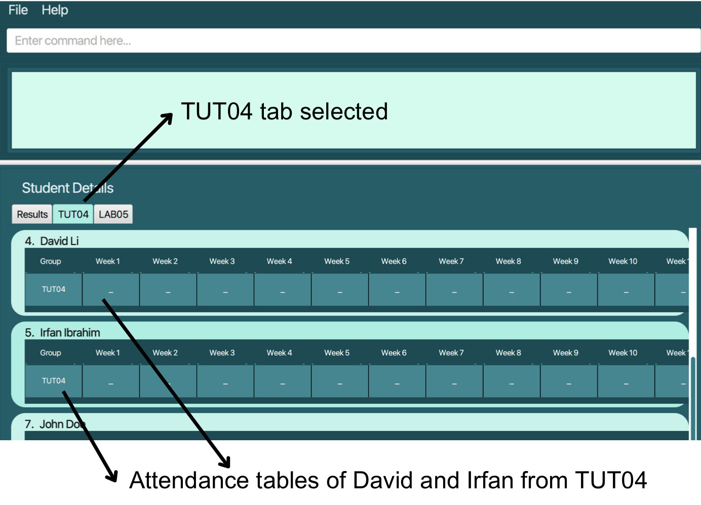
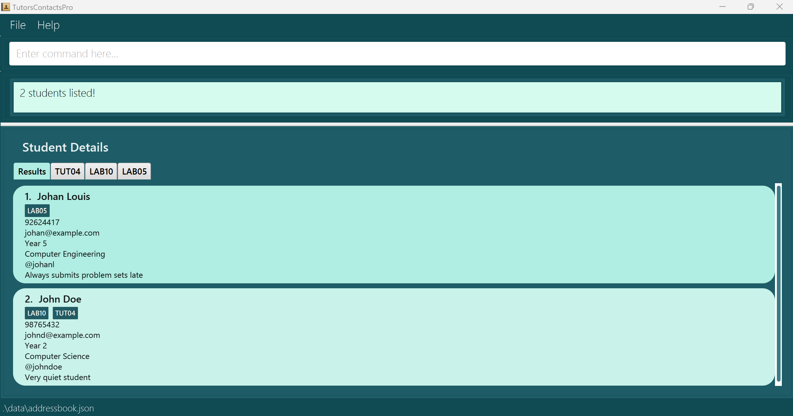
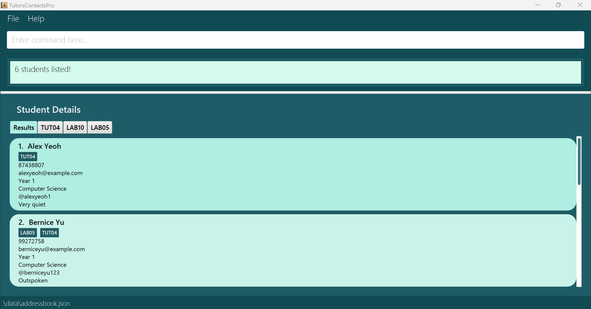
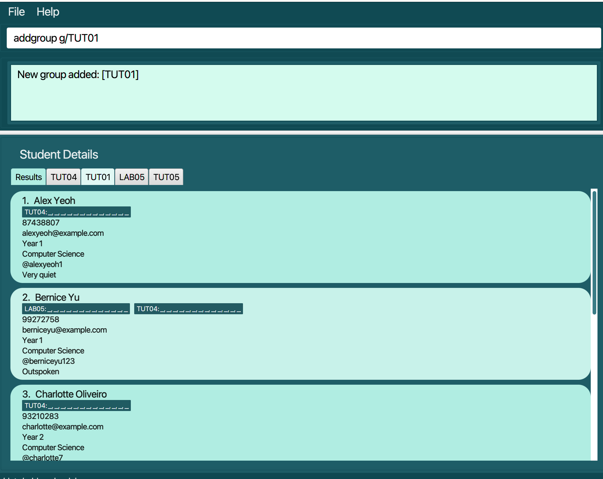
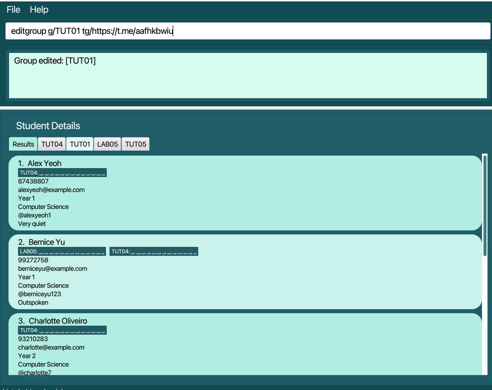
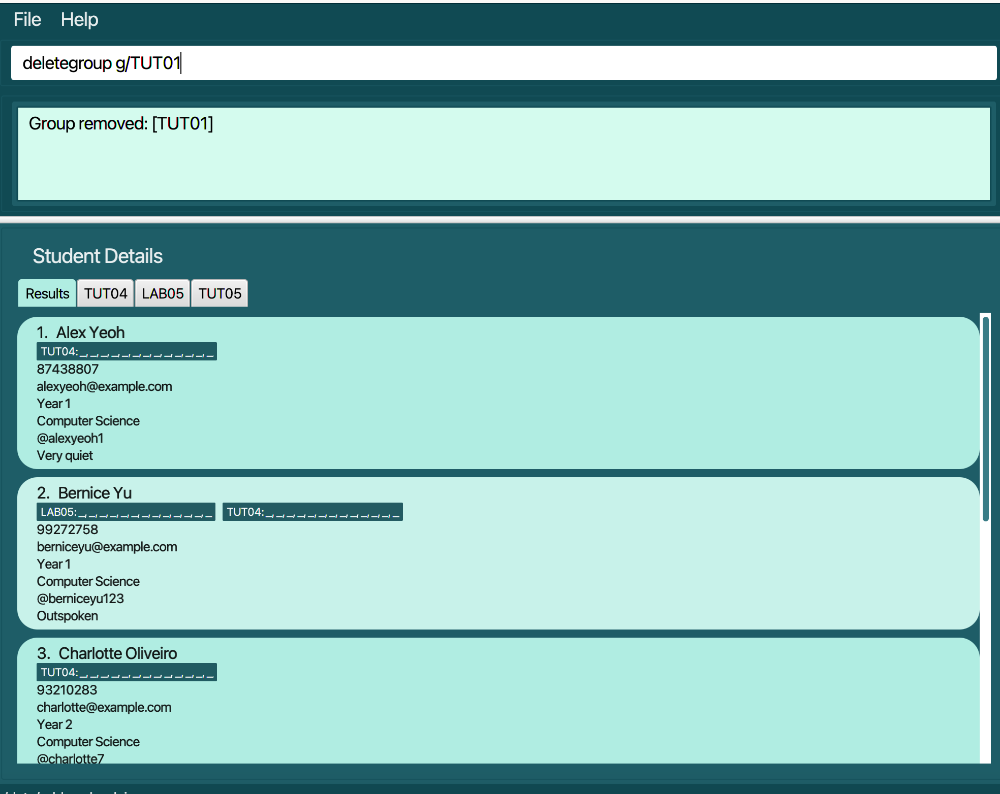
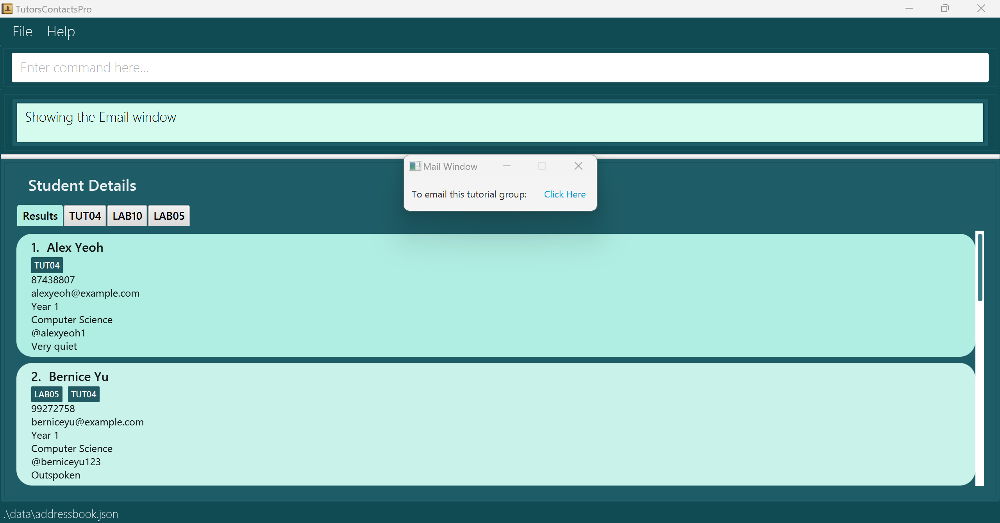
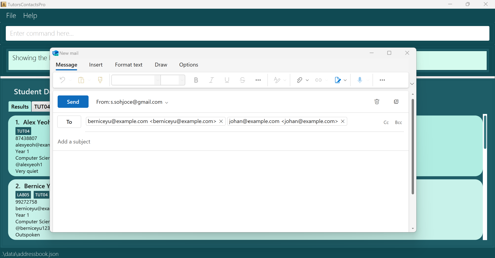
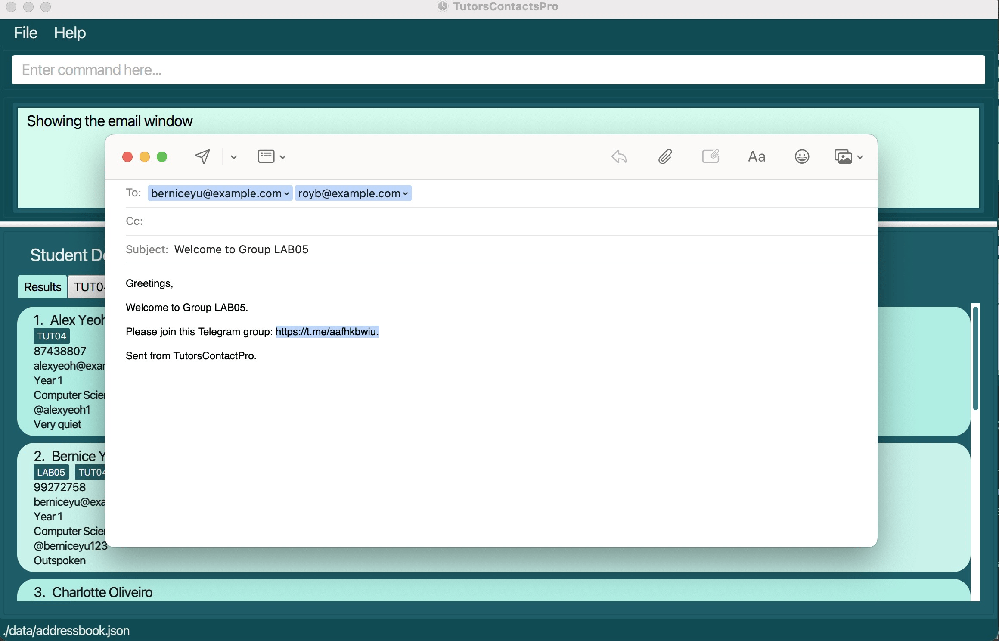

# Table of Contents
<!-- TOC -->
<page-nav-print />

## Quick Overview

* [Introduction](#feature-introduction)

  * [About TutorsContactsPro](#feature-about)

  * [About the User Guide](#feature-aboutUG)

  * [Navigating the User Guide](#navigating-the-user-guide)

* [Getting Started](#feature-gettingStarted)

  * [Installing and Launching TutorsContactsPro](#feature-install)

  * [Learning about TutorsContactsPro components](#feature-learn)

  * [Learning about TutorsContactsPro User Interface (UI)](#feature-ui)

  * [Quick Start](#feature-quickStart)

* [Command Notes](#feature-features)

* [Basic Commands](#feature-basicCommand)

  * [Viewing help: `help`](#feature-help)

  * [Listing all students: `list`](#feature-list)

  * [Clearing all entries: `clear`](#feature-clear)

  * [Exiting the program: `exit`](#feature-exit)

* [Student Commands](#feature-studentCommand)

  * [Adding a student: `add`](#feature-add)

  * [Editing a student: `edit`](#feature-edit)

  * [Locating students using keyword: `find`](#feature-find)

  * [Filtering students using group: `filter`](#feature-filter)

  * [Marking attendance of a student in the group: `mark`](#feature-mark)

  * [Deleting a student: `delete`](#feature-delete)

* [Group Commands](#feature-groupCommand)

  * [Adding a group: `addgroup`](#feature-addgroup)

  * [Editing a group: `editgroup`](#feature-editgroup)

  * [Deleting a group: `deletegroup`](#feature-deletegroup)

  * [Generating email template: `mail`](#feature-mail)

  * [Generating email template for telegram link: `mailtg`](#feature-mailtg)

* [FAQ](#feature-faq)

* [Known issues](#feature-issues)

* [Planned Enhancements](#feature-enhancements)

* [Command Summary](#feature-summary)

* [Appendix A: Installing Java](#feature-appendix-a-installing-java)

--------------------------------------------------------------------------------------------------------------------
# <span id='feature-introduction'> Introduction <span>


# <span id='feature-about'> About TutorsContactsPro <span>

Unlock the full potential of your teaching journey with TutorsContactsPro, the ultimate desktop tool designed for **NUS tutors and teaching assistants in Computer Science courses**.

Seamlessly navigate through student information with our intuitive blend of **Command Line Interface (CLI)** and **Graphical User Interface (GUI)**.

From effortless attendance tracking to personalized student profiles, TutorsContactsPro streamlines administrative tasks for maximum efficiency.

Experience the future of teaching management today with TutorsContactsPro!


## <span id='feature-aboutUG'> About the User Guide <span>

This user guide aims to provide you with the information needed to get started with TutorsContactsPro.

Feel free to turn back to this user guide if you encounter any problems or doubts while using TutorsContactsPro.

* If you are **new** to TutorsContactsPro, you may refer to the **[Navigating the User Guide](#navigating-the-user-guide)** section first, then to the **[Getting Started](#getting-started)** section to start installing and using TutorsContactsPro.

* If you would like to find out more about its **individual features**, you may refer to the **[Command Notes and Features](#feature-features)** section.

* If you are an **experienced user** and want to quickly refer to the various commands, you may refer to the **[Command Summary](#feature-summary)** section.

* If you would like to find out more about the **technical aspects of TutorsContactsPro**, you may refer to our **[Developer Guide](https://ay2324s2-cs2103t-W10-4.github.io/tp/DeveloperGuide.html)**.

* Finally, if you would like an **overview** of this entire user guide, you may refer to our **[Table of Contents](#table-of-contents)**.


## <span id='#navigating-the-user-guide'> Navigating the User Guide <span>
Throughout this user guide, the following symbols and keywords will be utilized for your convenience.

| Icons/Syntax | Meaning                                    |
|--------------|--------------------------------------------|
| ℹ️           | Information that you should take note of   |
| 💡           | Useful advice and tips                     |
| ⚠️           | Warnings you should read before proceeding |


Below is the glossary for important technical terms that you may find useful.

| Technical terms | Meaning                                                                                                                                                                                                                                            | 
|-----------------|----------------------------------------------------------------------------------------------------------------------------------------------------------------------------------------------------------------------------------------------------|
| CLI             | CLI stands for Command Line Interface. It is a text-based interface used for interacting with computer systems and executing commands by typing them into a terminal window.                                                                       | 
| GUI             | GUI stands for Graphical User Interface, a visual way of interacting with computers using icons and menus instead of text commands.                                                                                                                | 
| Command         | Command refers to a directive or instruction given to a computer system to perform a specific task or function.                                                                                                                                    |             
| GUI component   | GUI component refers to an element or part of a graphical user interface (GUI) that allows users to interact with the software application.                                                                                                        |
| UI              | A User Interface (UI) refers to the platform or system through which users interact with software applications or electronic devices, encompassing elements like graphical interfaces, command-line interfaces, and voice-controlled interfaces.   |
| Interface       | An interface is a platform or system that allows users to interact with software applications or electronic devices, aiming to create intuitive and user-friendly experiences.                                                                     |

[Table Of Contents](#table-of-contents)

--------------------------------------------------------------------------------------------------------------------


# <span id='feature-gettingStarted'>  Getting Started <span>

## <span id='feature-install'> Installing and Launching TutorsContactsPro <span>

### Step 1: Install Java

Ensure you have Java `11` or above installed on your computer. If you don't have Java installed, follow the instructions in [Appendix A: Installing Java](#appendix-a-installing-java).

### Step 2: Download

Download the latest `[CS2103T-W10-4][TutorsContactsPro].jar` from [here](https://github.com/AY2324S2-CS2103T-W10-4/tp/releases).

### Step 3: Set up TutorsContactsPro Home Folder

Copy or move the downloaded `[CS2103T-W10-4][TutorsContactsPro].jar` file to the folder you want to use as the _home folder_ for your TutorsContactsPro.

### Step 4: Launch TutorsContactsPro

1. Open a terminal (MacOS) or command prompt (Windows).

2. Navigate to the folder where you placed the `[CS2103T-W10-4][TutorsContactsPro].jar` file using the `cd` command. For example, John Doe has his `[CS2103T-W10-4][TutorsContactsPro].jar` file in `/Users/JohnDoe/Desktop/TutorsContactsPro`, so he'll run:

    ```bash
    cd /Users/JohnDoe/Desktop/TutorsContactsPro
    ```

3. If you are using terminal, verify that your working directory contains `[CS2103T-W10-4][TutorsContactsPro].jar` by using the `ls` command. 
Else if you are using command prompt, verify that your working directory contains `[CS2103T-W10-4][TutorsContactsPro].jar` by using the `dir` command.
You should see `TutorsContactsPro.jar` in the list of files printed. Here's what our John Doe got when running this command.

    ```bash
    JohnDoe@johndoe TutorsContactsPro % ls
    TutorsContactsPro.jar
    ```
4. Once your terminal's working directory is the folder that contains `[CS2103T-W10-4][TutorsContactsPro].jar`, run the following command to launch TutorsContactsPro:

    ```bash 
    java -jar TutorsContactsPro.jar
    ```

   After executing this command, a graphical user interface (GUI) similar to the one below should appear shortly:

   


Note: The application comes with some sample data for your reference.


---

## <span id='feature-learn'> Learning about TutorsContactsPro components <span>

---

### Students
A 'Student' is an individual that you will store in TutorsContactsPro.
It is an individual that attends one or more [`Groups`](#group) that you teach.
TutorsContactsPro allows you to store essential information or attributes about the student and remarks for them.

#### Attributes:

| Parameter         | Representation                           | Prefix | Constraints                                                                             |
|-------------------|------------------------------------------|--------|-----------------------------------------------------------------------------------------|
| `NAME`            | Name of the student                      | `n/`   | Auto-capitalization will be handled. Extra/trailing/leading spaces will be removed      |
| `PHONE_NUMBER`    | Phone number of the student              | `p/`   | Singapore phone number, 8 digits, without country code                                  |
| `EMAIL`           | Email of the student                     | `e/`   | Must be in email format `email username`@`domain`                                       |
| `YEAR`            | Academic Year of the student             | `y/`   | A number ranging from 1 - 6, inclusive                                                  |
| `MAJOR`           | Academic Major of the student contact    | `m/`   | String to represent the major                                                           |
| `TELEGRAM_HANDLE` | Telegram handle of the student           | `tg/`  | Telegram handle format (a-z, 0-9 and underscores, case-insensitive), without prefix “@” |
| `REMARKS`         | Additional remarks of the student        | `r/`   | A case-sensitive string. This can be anything                                           |
| `GROUP_NAME`      | Tutorial/Recitation/Lab slot             | `g/`   | Must be in correct slot format `TUT/REC/LAB` + `2-digit number`                         |

### Group

A `Group` is a lesson that is taught by you and attended by students.
It can only strictly be a Tutorial/Recitation/Lab.

#### Attributes:

| Parameter       | Representation             | Prefix  | Constraints                                                                     |
|-----------------|----------------------------|---------|---------------------------------------------------------------------------------|
| `GROUP_NAME`    | Name of the group          | `g/`    | Group name must begin with `TUT/REC/LAB` + `2-digit number`                     |
| `TELEGRAM_LINK` | Telegram link of the group | `tg/`   | Must be a valid Telegram group link                                             |
| `ATTENDANCE   ` | Attendance of the student  | `a/`    | A string array representing the attendance, initially automatically constructed |


## <span id='feature-ui'> Understanding the User Interface (UI) <span>
TutorsContactsPro's UI consists of 4 main parts that you will be using:

### Menu Bar
* In the menu bar, you can effortlessly exit TutorsContactsPro or access the help window with just a click of your mouse!
* Fear not if you are not well-versed in commands, the menu bar offers a beginner-friendly alternative to exit TutorsContactsPro or open the help window.

### Help:
Upon clicking help on the menu bar or by using the shortcut `F1`, you will be assisted with a help window pop-up.
More is to be explained in [`help`](#feature-help) feature.

### Command Panel
* The command panel where you will input commands and receive their corresponding results.
* You can type in your command in the upper box.
* And use the lower box to view the results of those commands.

### Student Panel
* The Student panel is a panel that you can use to see the list of students stored in TutorsContactsPro.
* You can see student's name, phone number, year of study, major, email address, group, Telegram handle and even whatever remarks that you have for each of them as needed!

The following image displays the layout of a student panel. 


### Result and Group Tabs
* There are labelled tabs below the `Student Details` header. 
* The leftmost `Results` tab will display the list of all student contacts that are taught by you. 
* The subsequent tabs are labelled with their respective group names. These tabs display the attendance table details of students that belong to the specific group labelled by that tab.

The following image displays the layout of the group tabs.


The following image summarises the overall layout of TutorsContactsPro's User Interface(UI).


## <span id='feature-start'> Quick start <span>
Type the command in the command box and press Enter to execute it. e.g. typing **`help`** and pressing Enter will open the help window.<br>
Some example commands you can try:

* [`list`](#feature-list) : Lists all students.

* [`clear`](#feature-clear) : Deletes all students on the list.

* [`exit`](#feature-exit) : Exits the app.

* [`add n/John Doe p/98765432 e/johnd@example.com y/2 m/Computer Science tg/johndoe r/Very quiet student g/TUT04 `](#feature-add) : Adds a student named `John Doe` to the list.

* [`edit 1 p/93840823 y/3 tg/jiejfh203`](#feature-edit) : Edits the first student on the current list.

* [`find John Tan`](#feature-find) : Lists all the students with names that matches 'John' or 'Tan'.

* [`filter TUT10`](#feature-filter) : Lists all the students in group 'TUT10'

* [`mark 1 g/TUT05 w/1 a/P`](#feature-mark) : Marks the attendance of the first student in group 'TUT05' as present in TutorsContactsPro.

* [`delete 3`](#feature-delete) : Deletes the third student shown in the current list.

* [`addgroup g/TUT01`](#feature-addgroup) : Adds the group 'TUT01' to TutorsContactsPro.

* [`editgroup g/TUT01`](#feature-editgroup) : Edits the group 'TUT01' in TutorsContactsPro.

* [`deletegroup g/TUT01`](#feature-deletegroup) : Deletes the group 'TUT01' in TutorsContactsPro.

* [`mail`](#feature-mail) : Generates a prefilled email template sent to emails of all students on the list.

* [`mailtg g/TUT01`](#feature-mailtg) : Generates a prefilled email template containing the telegram link for 'TUT01', with the recipient field prefilled with students of 'TUT01'.


5. Refer to the [Command Notes and Features](#feature-features) below for details of each command.

[Table Of Contents](#table-of-contents)

--------------------------------------------------------------------------------------------------------------------

## <span id='feature-features'> Command Notes and Features <span>

[//]: # (<box type="info" seamless>)

**Notes about the command format:**<br>

| Command format        | Representation                                                                                                                  | Examples                                                                                     |
|-----------------------|---------------------------------------------------------------------------------------------------------------------------------|----------------------------------------------------------------------------------------------|
| `UPPER_CASE`          | Words in `UPPER_CASE` are the parameters to be supplied by the user                                                             | In `add n/NAME`, `NAME` is a parameter which can be used as `add n/John Doe`                 |
| square brackets `[]`  | Items in square brackets are optional                                                                                           | `n/NAME [g/Group]` can be used as `n/John Doe g/TUT07` or as `n/John Doe`                    |
| `…`                   | Items with `…`​ after them can be used multiple times including zero times                                                      | `[g/GROUP]…​` can be used as `g/TUT03`, `g/LAB01`, `g/REC08`, etc.                           |
| Order                 | Parameters can be in any order                                                                                                  | If the command specifies `n/NAME p/PHONE_NUMBER`, `p/PHONE_NUMBER n/NAME` is also acceptable |
| Extraneous parameters |  Extraneous parameters for commands that do not take in parameters (such as `help`, `list`, `exit` and `clear`) will be ignored | If the command specifies `help 123`, it will be interpreted as `help`                        |                                                                                                 | Singapore phone number, 8 digits, without country code                                        |


> **⚠️Warning:**
If you are using a PDF version of this document, be careful when copying and pasting commands that span multiple lines as space characters surrounding line-breaks may be omitted when copied over to the application.
</box>

## <span id='feature-basicCommands'> Basic Commands <span>
This section contains the basic commands of TutorsContactsPro.


### <span id='feature-help'> Viewing help : `help` </span>

Allows you to easily access detailed information on how to use the different features in TutorsContactsPro.


Format: `help`

> ℹ️ **Information:**
> * Strictly enter only the `help` command. Any inputs after `help` will be ignored.
    E.g. When `help 44` is entered, the `44` input following `help` will be ignored and the `help` command will still be executed.

### <span id='feature-list'> Listing all students : `list` </span>

Shows a list of all your students, so that you can conveniently view all their details.

Format: `list`

> 💡**Tips:**
Auto-capitalization will be handled. Extra/trailing/leading spaces will be removed.
> ℹ️ **Information:**
> * Strictly enter only the `list` command. Any inputs after `list` will be ignored.
    E.g. When `list 44` is entered, the `44` input following `list` will be ignored and the `list` command will still be executed.


### <span id='feature-clear'> Clearing all entries : `clear` <span>

Clears all student entries from TutorsContactsPro, so that you can always start afresh in the next teaching semester.

Format: `clear`

> ℹ️ **Information:**
> * Strictly enter only the `clear` command. Any inputs after `clear` will be ignored.
    E.g. When `clear 44` is entered, the `44` input following `clear` will be ignored and the `clear` command will still be executed.

### <span id='feature-exit'> Exiting the program : `exit` <span>

Exits the program and your changes will be saved automatically.

Format: `exit`

## <span id='feature-studentCommands'> Student Commands <span>

This section contains commands for managing students in TutorsContactsPro.

### <span id='feature-add'> Adding a student: `add` </span>

Adds a student to the list, so that you can keep track of all student details easily.

Format: `add n/NAME p/PHONE_NUMBER e/EMAIL y/YEAR m/MAJOR tg/TELEGRAM_HANDLE [r/REMARK] [g/GROUP]…​`

> ℹ️ **Information:**
> * Allows addition of multiple groups to a student.
> * Allows optional addition of a single remark or group(s) to a student.
> * Allows addition of a student with an email that does not include a domain name as email can be hosted on a local machine. 

Examples:
* `add n/John Doe p/98765432 e/johnd@example.com y/2 m/Computer Science tg/johndoe r/Very quiet student g/TUT04 g/LAB05` 
   will add a student named John Doe to your student list.
  * Phone number: 98765432
  * Email address: johnd@example.com
  * Telegram handle: johndoe
  * Year of study: 2
  * Major: Computer Science
  * Remark: Very quiet student
  * Group(s): TUT04 and LAB05

* `add n/Kendra Huetta p/98765367 e/Kendra@example.com y/1 m/Computer Science tg/KendraHuetta r/quiet student g/LAB05`
   will add a student named Kendra Huetta, to your student list, as shown in the image below.
  * Phone number: 98765367
  * Email address: Kendra@example.com
  * Telegram handle: KendraHuetta
  * Year of study: 1
  * Major: Computer Science
  * Remark: quiet student
  * Group(s): LAB05


### <span id='feature-edit'> Editing a student : `edit` <span>

Edits an existing student you have selected. This way, you can always keep student details recorded up to date!

Format: `edit INDEX [n/NAME] [p/PHONE_NUMBER] [e/EMAIL] [y/YEAR] [m/MAJOR] [tg/TELEGRAM_HANDLE] [r/REMARK] [g/Group]…​`

> ℹ️ **Information:**
> * Edits the student at the specified `INDEX`. The index refers to the index number shown in the displayed student list. The index **must be a positive integer** 1, 2, 3, …​
> * At least one of the optional fields must be provided.


> 💡**Tips:**
> * Existing values will be updated to the input values. <br>
> * When editing groups, the existing groups of the student will be removed i.e adding of groups is not cumulative. <br>
> * You can remove all the student’s groups by typing `g/` without specifying any groups after it. <br>
> * You can remove the remark of a student by typing `r/` without specifying any remark after it. <br>


Examples:
*  `edit 1 n/John e/john01@example.com` Edits the name of the first student to `John` and email to `john01@example.com` respectively.
*  `edit 2 n/Betty tg/` Edits the name of the 2nd student to be `Betty` and clears her telegram handle.

### <span id='feature-find'> Locating students by keyword: `find` <span>
Finds students whose details include any of the specified keywords.
You can find a student even if the keywords **match only partially**.

Format: `find KEYWORD [MORE_KEYWORDS]`

> ℹ️ **Information:**
> * The search is case-insensitive. e.g `hans` will match `Hans`.
> * The order of the keywords does not matter. e.g. `Hans Bo` will match `Bo Hans`.
> * Only the student's name is searched.
> * Students matching at least one keyword will be returned (i.e. `OR` search).
    e.g. `Hans Bo` will return `Hans Gruber`, `Bo Yang`.

Examples:
* `find John` returns students `john` and `John Doe`.
* `find Jo` returns students `John Doe` and `Johan Louis` as shown in the image below.
  


### <span id='feature-filter'> Filtering students using group: `filter` <span>

Filters and lists students belonging to any of the given group name keyword.
You can filter students only when the keywords **match fully**.

Format: `filter KEYWORD [MORE_KEYWORDS]`

> ℹ️ **Information:**
> * The search is case-sensitive. e.g `tut04` will not match `TUT04`.
> * The order of the keywords does not matter. e.g. `TUT04 LAB05` will match all students in `TUT04` and/or `LAB05`.
> * Only student's group name is searched.
> * The group name KEYWORD provided must be an existing group in TutorsContactsPro for students to be filtered accurately. 
> * When a non-existing group name is provided, TutorsContactsPro will display the status message '0 students listed!'. 

Examples:
* `filter LAB10` returns only `Kendra Huetta` belonging to group `LAB10`.
* `filter TUT04` returns `John Doe` and `Johan Louis` belonging to group `TUT04` as shown in the image below.

  


### <span id='feature-mark'> Marking students attendance by group week number: `mark` <span>

Marks the student's attendance according to the group name and week number, allowing you to easily keep track of students' attendance details. This function marks if the student is absent or present.

Format: `mark INDEX g/GROUP_NAME w/WEEK a/ATTENDANCE`

> ⚠️️ **Constraint:**
> * `GROUP_NAME` must be in the correct format of `TUT/REC/LAB` + `2-digit number`, the group should exsist in the student
> * `WEEK` must be a valid week number, from 1 to 13.
> * `ATTENDANCE` must be either `A` for absent or `P`for present (should not be 'a' or 'p').

> ℹ️ **Information:**
> * Marks the student at the specified INDEX. The index refers to the index number shown in the displayed student list. The index must be a positive integer 1, 2, 3, …​
> * All the fields should be provided, index, group, week, attendance.
> * Since there are 13 weeks in total in a tutorial or lab, only 13 marks are available.
> * Resize the TutorsContactsPro window to view the full 13 weeks attendance table. 

Examples:
* `mark 1 g/TUT05 w/1 a/P` Marks the attendance of the 1st student in the list. Marks `TUT05` week 1 attendance as present.
* `mark 2 g/LAB05 w/1 a/A` Marks the attendance of the 2nd student in the list. Marks `LAB05` week 1 attendance as absent as shown in the image below.

  

### <span id='feature-delete'> Deleting a student : `delete` <span>

Deletes your specified student from the current list.

Format: `delete INDEX`

> ℹ️ **Information:**
> * Deletes the student at the specified `INDEX`.
> * The index refers to the index number shown in the current displayed student list.
> * The index **must be a positive integer** 1, 2, 3, …​

Examples:
* `find Betsy` followed by `delete 1` deletes the 1st student in the results of the `find` command.
* `list` followed by `delete 6` deletes the 6th student in TutorsContactsPro. In the example below, John Doe, the 6th student is deleted.
  


## <span id='feature-groupCommands'> Group Commands <span>

This section contains commands for managing groups in TutorsContactsPro.

### <span id='feature-addgroup'> Adding a group: `addgroup` <span>

Adds a new group to TutorsContactsPro, so that you can keep track of the groups you currently teach.
TutorsContactsPro will then automatically generate a dedicated tab for each new group added.

format: `addgroup g/GROUP_NAME`

> ⚠️️ **Constraint:**
> * `GROUP_NAME` must be in the correct format of `TUT/REC/LAB` + `2-digit number`.

> ℹ️ **Information:**
> * Adds a group with a given group name.
> * Group names are unique.


Examples:
* `addgroup g/LAB12` adds the group `LAB12` to TutorsContactsPro.
* `addgroup g/TUT01` adds the group `TUT01` to TutorsContactsPro as shown in the image below.
  

### <span id='feature-editgroup'> Editing a group: `editgroup` <span>

Edits an existing group in TutorsContactsPro, allowing you to add or edit the Telegram invite link assigned for each group so that you can remain up to date with each group's information.

Format: `editgroup g/GROUP_NAME tg/TELEGRAM_LINK`

> ⚠️️ **Constraint:**
> * `GROUP_NAME` must be in the correct format of `TUT/REC/LAB` + `2-digit number`.
> * The Telegram invite link must be a valid Telegram group invite link or an empty string.

> ℹ️ **Information:**
> * Assigns the Telegram group invite link provided in `TELEGRAM_LINK` to the group with the given `GROUP_NAME`. 

Examples
* `editgroup g/LAB12 tg/https://t.me/abcdefg` adds the specified Telegram link `https://t.me/abcdefg` to group `LAB12`.
* `editgroup g/TUT01 tg/` removes the Telegram link from group `TUT01`.
* `editgroup g/TUT01 tg/https://t.me/aafhkbwiu` adds the specified Telegram link `/https://t.me/aafhkbwiu` to group `TUT01` as shown in the image below.
    

### <span id='feature-deletegroup'> Deleting a group: `deletegroup` <span>

Deletes an existing group in TutorsContactsPro, so that you can start a fresh for the next teaching semester.
TutorsContactsPro will then remove the dedicated tab for the group deleted.

Format: `deletegroup g/GROUP_NAME`

> ⚠️️ **Constraint:**
> * `GROUP_NAME` must be in the correct format of `TUT/REC/LAB` + `2-digit number`.

Examples:
* `deletegroup g/LAB12` deletes the group `LAB12` from TutorsContactsPro.
* `deletegroup g/TUT01` deletes the group `TUT01` from TutorsContactsPro as shown in the image below.
  

### <span id='feature-mail'> Generating email template : `mail` <span>

Generates a prefilled email template containing the email addresses of students based on specific `GROUP NAME` entered.

A pop-up window will be generated, allowing you to open the email template with a simple 'click' for greater convenience.

Format: `mail [GROUP_NAME]`

> ℹ️ **Information:**
> * `GROUP_NAME` must be in the correct format of `TUT/REC/LAB` + `2-digit number`.
> * `GROUP_NAME` must be a valid existing group.
> * It requires a **full match** for the keyword.
> * `GROUP_NAME` is optional and when no `GROUP_NAME` is entered, email addresses of all students on the current list will be included.
> * If `GROUP_NAME` is entered, only email addresses of students belonging to the `GROUP_NAME` specified will be included.

Examples:
* `mail` generates a email template containing email addresses of all students on the current list.
* `mail LAB05` generates a email template containing email addresses of all students belonging to `LAB05` as shown in the image below.



The image below shows the email template generated.



### <span id='feature-mailtg'>  Generating email template for Telegram link: `mailtg` <span>

Generates a prefilled email template, including the Telegram link for that specific group and email addresses of student recipients from the specified group.

A pop-up window will be generated, allowing you to open the email template with a simple 'click' for greater convenience.

Format: `mailtg g/GROUP_NAME`

> ℹ️ **Information:**
> * `GROUP_NAME` must be in the correct format of `TUT/REC/LAB` + `2-digit number`.
> * `GROUP_NAME` must be a valid existing group.
> * It requires a **full match** for the keyword.
> * With contrast to the previous `mail` command, `mail` command catered for multiple groups whereas `mailtg` command is catered to generating an email template with respect to a specific group. 

Examples:
* `mailtg g/TUT04` generates a email template containing the Telegram link for group `TUT04` and with pre-filled email addresses of all students belonging to `TUT04`.
* `mailtg g/LAB05` generates a email template containing the Telegram link for group `LAB05` and with pre-filled email addresses of all students belonging to `LAB05` as shown in the images below.


The image below shows the email template containing the group Telegram link generated.



### Saving the data

TutorsContactsPro data are saved in the hard disk automatically after any command that changes the data. There is no need to save manually.

### Editing the data file

TutorsContactsPro data are saved automatically as a JSON file `[JAR file location]/data/addressbook.json`. Advanced users are welcome to update data directly by editing that data file.

[//]: # (<box type="warning" seamless>)

> **⚠️ Caution:**
If your changes to the data file makes its format invalid, TutorsContactsPro will discard all data and start with an empty data file at the next run.  Hence, it is recommended to take a backup of the file before editing it.<br>
Furthermore, certain edits can cause the TutorsContactsPro to behave in unexpected ways (e.g., if a value entered is outside the acceptable range). Therefore, edit the data file only if you are confident that you can update it correctly.
</box>

### Archiving data files `[coming in v2.0]`

_Details coming soon ..._

[Table Of Contents](#table-of-contents)

--------------------------------------------------------------------------------------------------------------------

## <span id='feature-faq'> FAQ <span>

**Q**: How do I transfer my data to another computer?<br>
**A**: Install the app in the other computer and overwrite the empty data file it creates with the file that contains the data of your previous TutorsContactsPro home folder.

[Table Of Contents](#table-of-contents)

--------------------------------------------------------------------------------------------------------------------

## <span id='feature-issues'> Known issues <span>

1. **When using multiple screens**, if you move the application to a secondary screen, and later switch to using only the primary screen, the GUI will open off-screen. The remedy is to delete the `preferences.json` file created by the application before running the application again.

[Table Of Contents](#table-of-contents)

--------------------------------------------------------------------------------------------------------------------

## <span id='feature-enhancements'> Planned Enhancements <span> 
Given below are the planned future enhancements for the application.

1. **Improve add feature**: Currently, TutorContactsPro allows the addition of students with the same exact details and names but different case for names which can be misleading. This can result in addition of duplicate students instead. Hence, we plan to improve the `add` feature to detect whether students added have completely similar details regardless of casing and throw a duplicate student added warning where appropriate.

2. **Allow the display of Telegram invite link**: TutorsContactsPro currently only allows the assignment of the Telegram invite link to a specific group via the `editgroup` command which is not too informative. We plan to improve the interface to include a field to display the Telegram invite link assigned for each specific group.

3. **Improve the group tabs**: After marking the attendance in a particular group tab, TutorsContactsPro currently will automatically direct users to the results tab which can result in inconvenience for users. We plan to improve the group tabs interface such that users will still be able to remain on their selected group tab aftering executing any commands.

4. **Improve add Telegram link feature**: Currently, TutorsContactsPro only allows the assignment of a Telegram invite link to a specific group via the `editgroup` command which may not be very intuitive for users. We plan to improve this feature by combining it with the `addgroup` feature to allow addition of a group together with the Telegram invite link.

5. **Add unmark attendance feature**: TutorsContactsPro currently allows TA users to mark the attendance for a particular student which can be inconvenient when users make a mistake marking the attendance and they are unable to undo it. Therefore, in the future, we plan to include an additional unmark attendance feature for a specified student.

6. **Improve generation of email template command**: The current `mail` command only takes in the `GROUP_NAME` input with no prefixes whereas the `mailtg` command takes in a `g/` prefix with a `GROUP_NAME` input. The difference in the command format for these two closely related commands can make it complex for users. Therefore, we plan to simplify and standardise the command input for `mail` and `mailtg` to be `g/GROUP_NAME`.

7. **Improve generation of email template command**: When executing mail, mailtg command with an invalid group, including an non-existing group, empty group and group without Telegram invite link. TutorsContactsPro currently does not display a warning for users. We plan to improve them such that a warning message will be displayed when the input provided is invalid.

8. **Make filter feature error message more specific**: When filtered with a non-existing group, the current error message displays `0 students listed!` which is too general. We plan to use `filter` command to check whether the `GROUP_NAME` provided is an existing group. The error message will then also mention the reason for failing to filter any students: `Group does not exist, 0 students listed!`

_coming soon ..._

[Table Of Contents](#table-of-contents)

--------------------------------------------------------------------------------------------------------------------


## <span id='feature-summary'> Command summary <span>

| Action          | Format, Examples                                                                                                                                                                                                        |
|-----------------|-------------------------------------------------------------------------------------------------------------------------------------------------------------------------------------------------------------------------|
| **Help**        | `help`                                                                                                                                                                                                                  |
| **List**        | `list`                                                                                                                                                                                                                  |
| **Add**         | `add n/NAME p/PHONE e/EMAIL y/YEAR m/MAJOR tg/TELEGRAM [r/REMARK] [g/GROUP_NAME]...` <br> e.g., `add n/John Doe p/98765432 e/johnd@example.com y/2 m/Computer Science tg/johndoe r/Very quiet student g/TUT04 g/LAB10 ` |
| **Edit**        | `edit INDEX [n/NAME] [p/PHONE] [e/EMAIL] [y/NUMBER] [m/MAJOR] [tg/TELEGRAM] [r/REMARK] [g/GROUP_NAME]`<br> e.g., `edit 1 n/John e/john01@example.com`                                                                   |
| **Find**        | `find KEYWORD [MORE_KEYWORDS]`<br> e.g.,`find john tan`                                                                                                                                                                 |
| **Filter**      | `filter KEYWORD [MORE_KEYWORDS]`<br> e.g.,`filter TUT01`                                                                                                                                                                |
| **Mark**        | `mark INDEX g/GROUP_NAME w/WEEK a/ATTENDANCE` <br> e.g., `mark 3 g/TUT02 w/1 a/A`                                                                                                                                       |
| **Delete**      | `delete INDEX`<br> e.g., `delete 1`                                                                                                                                                                                     |  
| **Addgroup**    | `addgroup g/GROUP_NAME`                                                                                                                                                                                                 |
| **Editgroup**   | `editgroup g/GROUP_NAME tg/TELEGRAM_LINK`                                                                                                                                                                               |
| **Deletegroup** | `deletegroup g/GROUP_NAME`                                                                                                                                                                                              |
| **Mail**        | `mail [GROUP_NAME]`<br> e.g., `mail TUT01`                                                                                                                                                                              |  
| **Mailtg**      | `mailtg g/GROUP_NAME`<br> e.g., `mailtg g/TUT01`                                                                                                                                                                        |
| **Clear**       | `clear`                                                                                                                                                                                                                 |


[Table Of Contents](#table-of-contents)

--------------------------------------------------------------------------------------------------------------------

## <span id='feature-appendix-a-installing-java'> Appendix A: Installing Java <span>

Follow these steps to install Java on your computer:

1. **Download Java 11:**
- Download Java 11 from [Oracle's website](https://www.oracle.com/sg/java/technologies/javase/jdk11-archive-downloads.html) based on your operating system.

2. **Follow the instructions on Oracle's website**
  - Go to the appropriate guide page and follow the instructions based on your operating system to complete the installation.
    - [MacOS](https://docs.oracle.com/en/java/javase/11/install/installation-jdk-macos.html#GUID-2FE451B0-9572-4E38-A1A5-568B77B146DE)
    - [Windows](https://docs.oracle.com/en/java/javase/11/install/installation-jdk-microsoft-windows-platforms.html#GUID-A7E27B90-A28D-4237-9383-A58B416071CA)
    - [Linux](https://docs.oracle.com/en/java/javase/11/install/installation-jdk-linux-platforms.html#GUID-737A84E4-2EFF-4D38-8E60-3E29D1B884B8)

3. **Verify Installation:**
   After installation, open a terminal (on MacOS) or Command Prompt (on Windows) and run the following commands to verify that Java is installed:

  ```
   java -version
  ```
If installed correctly, you should see version information for both Java and the Java Compiler. The message should look something like this:
```
openjdk version "11.0.20" 2023-07-18 LTS
OpenJDK Runtime Environment Zulu11.66+15-CA (build 11.0.20+8-LTS)
OpenJDK 64-Bit Server VM Zulu11.66+15-CA (build 11.0.20+8-LTS, mixed mode)
```

Now, you're ready to proceed with the launching of TutorsContactsPro. Click [here](#feature-install) to get back to the installation tutorial.

[Table Of Contents](#table-of-contents)
